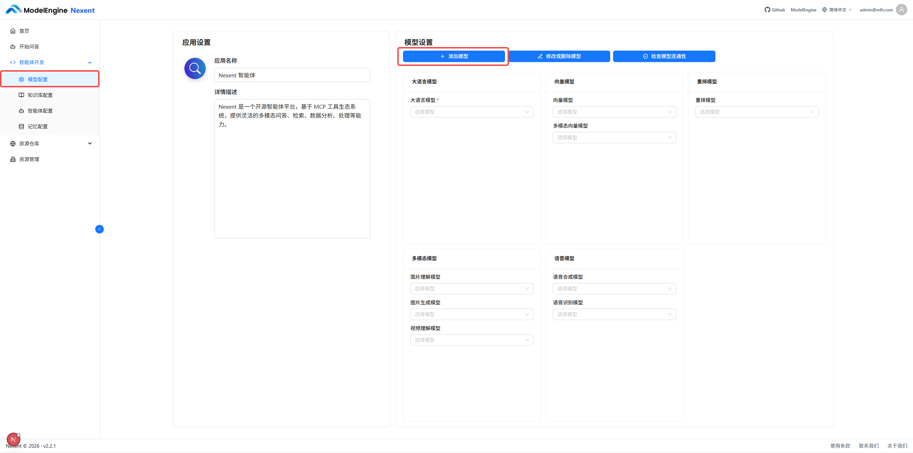
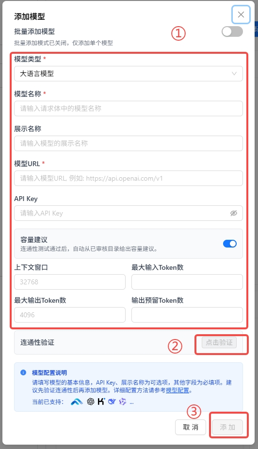
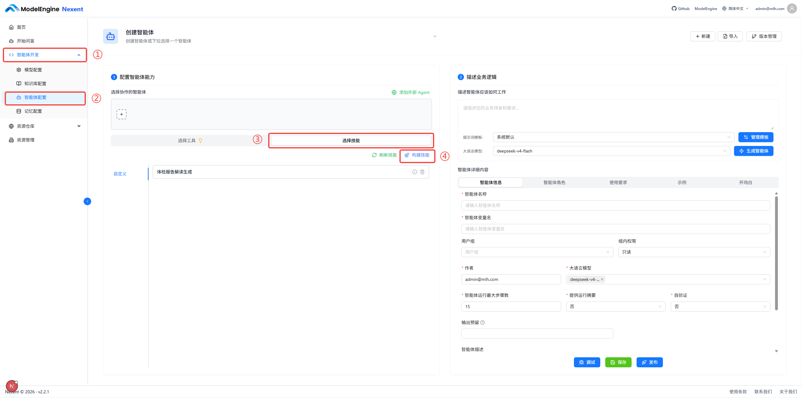
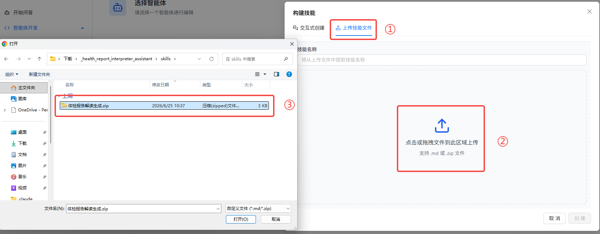
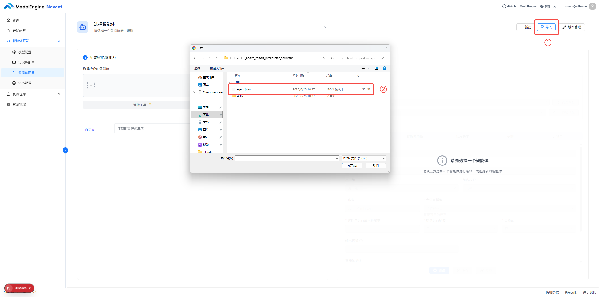
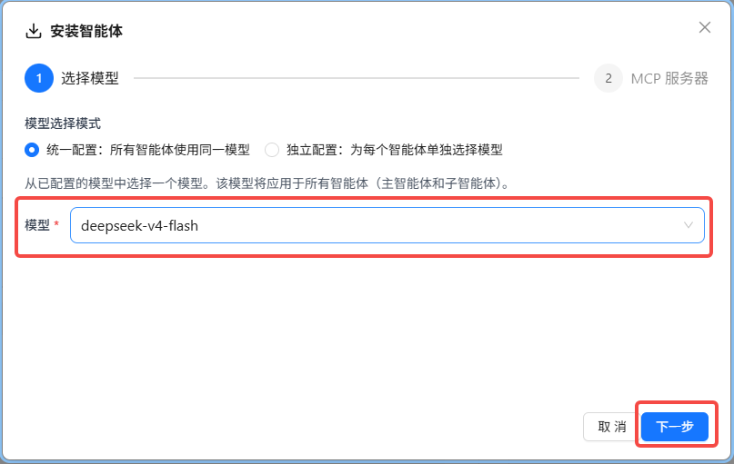
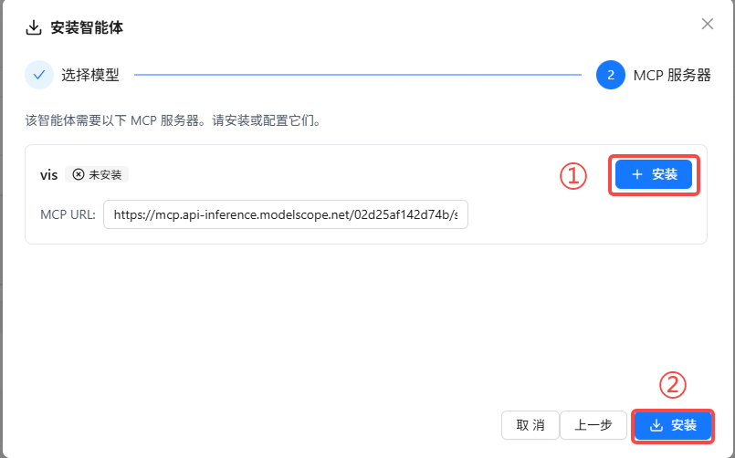
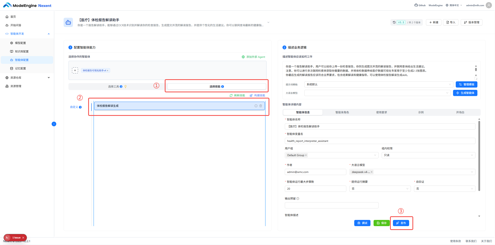

# 智能体模板使用指导

本指南详细介绍如何基于Nexent平台使用本仓库中的智能体，在使用智能体之前，需要安装部署Nexent平台，可以参考Nexent开发文档中的[安装指导](https://modelengine-group.github.io/nexent/zh/quick-start/installation.html)。

在完成安装后，下载本仓库中的智能体模板，按照如下步骤导入使用智能体：

1. [添加模型](#一添加模型)
2. [上传技能](#二上传技能)
3. [导入智能体](#四导入智能体)
4. [发布智能体](#五发布智能体)

---

## 一、添加模型

在使用智能体之前，首先需要准备好可供智能体使用的大语言模型。

### 操作步骤

1. 进入模型配置页面，点击 **添加模型** 按钮。
2. 填写模型名称、URL 地址、API Key 等必要信息。
3. 点击验证，测试模型的连通性。
4. 点击添加，完成模型添加。

### 图示

---

## 二、上传技能

若智能体包含skills，需要先上传智能体需要的技能，才能在智能体中引用。

### 操作步骤

1. 点击智能体开发，进入智能体配置页面。
2. 选择技能->构建技能。
3. 将skills文件夹中的zip文件上传到平台，完成技能创建。

### 图示

---

## 四、导入智能体

技能上传完成后，即可创建并导入智能体。

### 操作步骤

1. 进入智能体配置页面，点击 **导入**。
2. 将智能体仓库中的json文件导入平台。
3. 选择智能体要使用的大语言模型。
4. 安装智能体需要使用的MCP工具。
5. 完成智能体安装。

### 图示

---

## 五、发布智能体

智能体配置完成后，最后一步是发布上线。

### 操作步骤

1. 在智能体配置页面选择刚才上传的技能。
2. 确认发布信息，选择发布范围（如指定用户群组）。
3. 点击确认，完成发布，后续即可在开始问答中使用智能体了。

### 图示

---

---

按照以上步骤操作，即可完成智能体的完整发布流程。如在操作中遇到问题，请参考各步骤对应的图示进行核对。