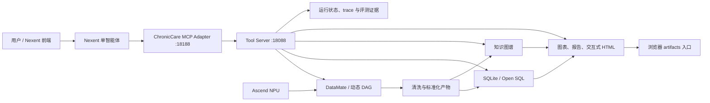
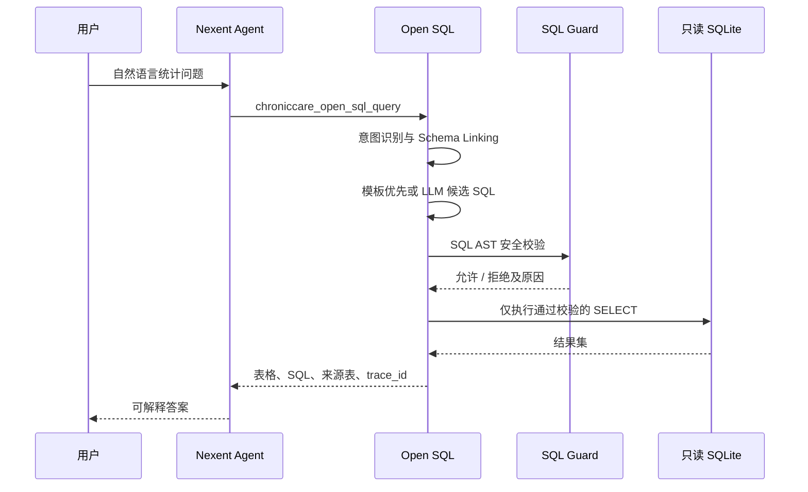

# ChronicCare-Agent 系统架构

## 1. 架构目标

系统需要同时满足三类需求：

1. 将结构化或半结构化慢病随访数据编排为可追踪、可恢复的数据处理链路。
2. 把患者、疾病、随访、检验、用药、风险和生活方式组织为可查询的知识图谱。
3. 允许用户在 Nexent 前端通过自然语言完成统计、趋势、关联、Open SQL 和图文可视化分析。

系统采用“一个 Nexent 智能体 + 一组职责清晰的 MCP 工具”的结构。Nexent 负责理解问题、规划和选择工具；ChronicCare 后端负责执行确定性计算、查询真实数据库、构建图谱和生成可访问的产物。

后端MCP服务公开38个工具，Nexent默认绑定清单选择其中33个；5个历史兼容入口仅保留后端实现，2个调试工具继续绑定用于工程排查。

## 2. 总体架构

正式部署使用单个 `chroniccare-runtime` 容器，同时启动 Tool Server、MCP Adapter 和可选的Streamlit辅助Dashboard。Nexent是主要交互与功能测试入口，通过MCP Endpoint调用ChronicCare，不直接读取项目文件。

## 3. 模块职责

| 模块 | 目录 | 主要职责 |
| --- | --- | --- |
| Tool Server | `tool_server/` | HTTP API、真实数据查询、图表/报告/图谱产物服务 |
| MCP Adapter | `mcp_adapter/` | 将后端能力包装为 Nexent 可调用的 MCP 工具 |
| Nexent 集成 | `integrations/nexent/` | Agent 提示词、MCP 示例配置、工具清单和接入说明 |
| DataMate 集成 | `integrations/datamate/` | 11 个主线算子、2 个 NPU 增强算子的交付源码和契约 |
| 动态编排 | `orchestration/dag/` | 按目标裁剪 DAG、执行、状态追踪、重试和断点恢复 |
| Open SQL | `analysis/open_sql/` | 意图识别、Schema Linking、候选 SQL、SQL Guard、只读执行 |
| 知识图谱 | `kg/`、`data/graph/` | 图谱构建、实体/关系查询、患者路径和子图 |
| 可视化 | `visualization/` | 统计图、趋势图、图谱预览和交互式 HTML |
| 数据与产物 | `data/`、`outputs/` | SQLite、图谱、处理结果、报告和评测证据 |
| 统一运行时 | `deploy/runtime/` | 单容器启动、进程管理和健康检查 |

## 4. 数据处理链路

DataMate 主线包含 11 个 CPU/通用算子：

1. `chronic_file_ingest`：接入输入文件。
2. `chronic_table_clean`：表级清洗。
3. `chronic_field_normalize`：字段标准化。
4. `chronic_text_split`：文本切分。
5. `chronic_entity_extract`：规则实体抽取。
6. `chronic_relation_extract`：规则关系抽取。
7. `chronic_triple_validate`：三元组合法性校验。
8. `chronic_kg_build`：知识图谱构建。
9. `chronic_sqlite_loader`：分析数据库加载。
10. `chronic_nl2sql_analyze`：NL2SQL 分析与评测。
11. `chronic_report_pack`：结果和报告打包。

两个 NPU 增强算子分别是：

- `chronic_entity_extract_model_npu`：实体候选的 BGE 表征与标准化。
- `chronic_relation_extract_model_npu`：关系候选的 BGE 表征与重排。

NPU 只加速适合矩阵计算的模型推理热点。文件读取、规则召回、清洗、校验、SQLite 加载和报告打包仍由 CPU 执行。NPU 不可用时可回退至 CPU BGE 路径，但性能报告必须明确标记 fallback，不能宣称 NPU 加速。

## 5. 动态 DAG

动态 DAG 根据用户目标选择最小必要子图：

- “只清洗数据”只规划接入、清洗和字段标准化。
- “只重建知识图谱”执行实体、关系、校验和图谱构建相关节点。
- “只刷新分析库”执行数据准备和 SQLite 加载。
- “完整链路”执行 11 个主线算子。
- “启用 NPU 增强”在实体和关系阶段插入两个 NPU 分支。

每个节点记录依赖、状态、开始/结束时间、输入输出摘要和错误。执行器支持 dry-run、失败重试、失败状态保留和指定 `run_id` 的断点恢复。输入或版本变化时，不复用失效缓存。

## 6. Open SQL 安全链路

SQL Guard 基于 SQL AST 校验，只允许白名单表、字段、函数和 JOIN；禁止 DDL、DML、多语句、系统表、注释绕过、危险函数和非白名单关联。LLM 仅负责生成候选 SQL，不能绕过 Guard。

## 7. 知识图谱与可视化

知识图谱当前包含 197,404 个节点和 396,928 条边，覆盖 14 类实体和 15 类关系。全局入口只展示图谱规模、类型分布和概览，不尝试在浏览器一次渲染全部节点；疾病、疾病组合和关系分析使用按问题实时生成的有限子图。

子图工具同时返回：

- 结构化 `nodes`、`edges`；
- 图谱预览；
- 可交互 HTML 地址；
- 查询口径和证据说明。

统计分析工具生成表格、柱状图、饼图或折线图，并通过 Tool Server 的 artifacts 入口提供给 Nexent 前端。

## 8. 扩展方式

- 新增疾病或指标：更新字典、数据契约和图谱映射，不修改 Agent 主流程。
- 新增分析能力：优先增加职责单一的 MCP 工具，并在提示词中定义路由边界。
- 新增 DataMate 算子：提供清晰的输入输出契约、状态和可复用实现，再加入 DAG。
- 新增硬件后端：保持算子契约不变，以独立实现替换模型推理分支。
- 新增可视化：消费标准化表格或子图 JSON，不与查询逻辑耦合。

