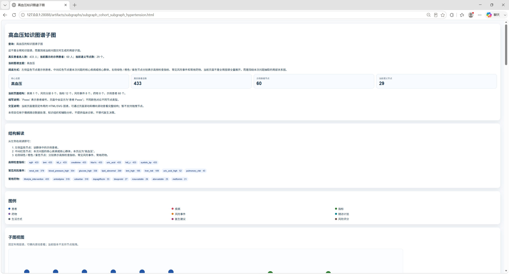
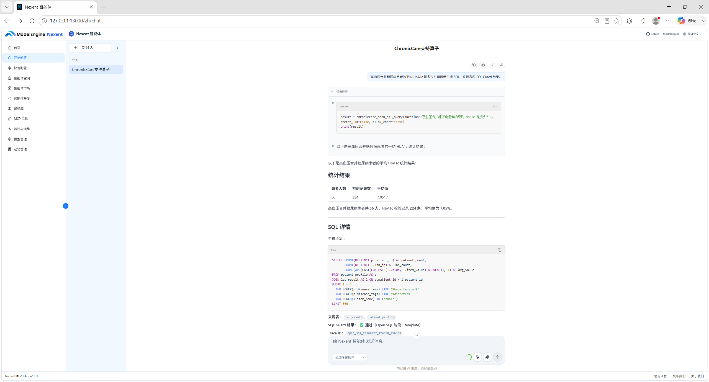

# ChronicCare-Agent 技术报告

**交付日期：2026年8月10日**

## 摘要

ChronicCare-Agent 是一个基于 Nexent、DataMate 和 Ascend NPU 的慢病随访“数据—知识—洞察”智能体。项目使用 Nexent 单智能体作为自然语言入口，通过 MCP Adapter 调用数据处理、知识图谱、受控 Open SQL、统计分析和可视化工具；DataMate 负责可组合的数据处理算子链路；知识图谱组织患者、疾病、随访、检验、药物、风险和生活方式关系；NPU 增强分支加速实体与关系阶段中的 BGE 推理热点。

当前交付版使用参考真实慢病随访业务的字段结构、业务关系和合理取值范围，采用程序化规则与固定随机种子合成的 2,000 名患者数据，包含 8,231 条随访记录、131,323 条检验记录和 18,248 条用药记录，覆盖 20 种慢病。知识图谱包含 197,404 个节点、396,928 条边、14 类实体和 15 类关系。项目提供240题NL2SQL盲测集和外部模型调用评测入口；SQL Guard在120例安全评测中达到100%。

> 安全边界：本项目仅用于慢病随访数据处理、知识组织和辅助分析，不提供临床诊断，不替代医生决策。

## 1. 项目背景与目标

慢病随访数据具有持续时间长、数据来源多、患者共病普遍和指标关联复杂等特点。单纯表格查询难以回答跨患者、疾病、检验、药物和风险的关联问题；完全依赖大模型自由生成，又可能造成统计口径不稳定、SQL 不安全或结果不可追溯。

本项目的目标是：

1. 建立可由智能体理解、规划和执行的数据处理算子链路。
2. 自动构建医疗领域知识图谱，并提供实体、关系、路径和子图问答。
3. 在统一数据与图谱基础上完成统计、关联、趋势、Open SQL 和图文可视化分析。
4. 将适合并行计算的 BGE 推理热点迁移到 Ascend NPU，并提供公平、可复核的 CPU/NPU 实测。
5. 通过确定性工具、SQL Guard、真实 Observation 和证据产物降低大模型幻觉风险。

## 2. 总体方案

系统由以下层次组成：

- **交互与规划层**：Nexent 单智能体理解用户问题，并按提示词约束选择最合适的 MCP 工具。
- **工具协议层**：MCP Adapter 将后端接口包装为带输入输出契约的工具。
- **业务服务层**：Tool Server 提供数据统计、图谱、Open SQL、DataMate、DAG、NPU 和 artifacts 服务。
- **数据处理层**：DataMate 11 个主线算子与动态 DAG 完成接入、清洗、抽取、校验、图谱、SQLite 和报告处理。
- **知识与分析层**：SQLite 支撑确定性统计和 Open SQL；知识图谱支撑跨实体关联、证据和子图。
- **可视化层**：生成表格、柱状图、饼图、折线图、图谱预览和交互式 HTML。
- **硬件加速层**：两个 NPU 增强算子执行 BGE embedding 标准化和关系重排。

详细模块关系见 [系统架构](architecture.md)。

## 3. 任务一：数据处理智能体

### 3.1 DataMate 算子

系统提供 11 个 CPU/通用主线算子：

| 分组 | 算子 | 作用 |
| --- | --- | --- |
| 数据清洗 | `chronic_file_ingest` | 文件接入 |
| 数据清洗 | `chronic_table_clean` | 表格清洗 |
| 数据清洗 | `chronic_field_normalize` | 字段标准化 |
| 数据清洗 | `chronic_text_split` | 文本切分 |
| 知识图谱 | `chronic_entity_extract` | 实体规则抽取 |
| 知识图谱 | `chronic_relation_extract` | 关系规则抽取 |
| 知识图谱 | `chronic_triple_validate` | 三元组校验 |
| 知识图谱 | `chronic_kg_build` | 图谱构建 |
| 数据分析 | `chronic_sqlite_loader` | SQLite 加载 |
| 数据分析 | `chronic_nl2sql_analyze` | NL2SQL 分析 |
| 数据分析 | `chronic_report_pack` | 报告打包 |

算子通过明确的输入输出契约组合，执行状态和耗时可追踪。Nexent 前端提出“请重新执行 DataMate 算子链路”时，系统必须真实运行本轮链路并等待 Observation，不能读取旧报告直接回答。

### 3.2 动态 DAG

动态 DAG 将用户目标转换为所需算子的最小依赖图。它支持：

- 只生成计划而不执行；
- 只清洗、只重建知识图谱、只刷新分析库或执行完整链路；
- 启用或关闭 NPU 增强分支；
- 节点级状态、错误、重试和断点恢复；
- 输入或版本变化后的缓存失效。

该设计使 Agent 不必为每个流程维护固定脚本，也避免在只需局部结果时运行完整链路。

## 4. 任务二：知识图谱问答智能体

### 4.1 图谱模式

当前图谱覆盖 14 类实体，包括患者、疾病、随访、检验结果、指标、药物、药物类别、风险事件、随访计划、生活方式、医嘱和风险评分等；覆盖 15 类关系，包括患者患病、患者随访、随访检验、检验归属指标、指标异常风险、疾病关联指标、随访用药、药物类别和疾病用药等。

图谱规模如下：

| 指标 | 数值 |
| --- | ---: |
| 节点 | 197,404 |
| 边 | 396,928 |
| 实体类型 | 14 |
| 关系类型 | 15 |
| 精确重复边 | 0 |
| 边来源信息完整率 | 100% |

### 4.2 构建与问答

规则抽取首先保证确定性覆盖，BGE 分支用于候选标准化和重排，随后三元组校验拒绝非法实体引用和关系类型。构建完成后，系统提供：

- 图谱规模和类型概览；
- 疾病关联指标、药物和风险查询；
- 两个实体间的关系证据；
- 患者路径查询；
- 疾病、疾病组合和关系主题的实时子图；
- 图谱预览和可交互 HTML。

全局概览不在浏览器直接加载约 20 万节点，而是展示规模与类型摘要；需要分析时再按问题生成有限子图，兼顾可用性和可解释性。

*图1 高血压知识图谱实时子图概览*

## 5. 任务三：数据分析与图谱驱动可视化

### 5.1 专用统计工具

对于数据规模、疾病分布、共病组合、风险分层和未来高风险随访等高频问题，系统使用职责单一的确定性工具。工具直接读取当前 SQLite 或图谱，返回统计口径、表格和可选图表，避免大模型自行计算。

### 5.2 受控 Open SQL

对于非固定问句，系统采用：

1. 意图识别；
2. Schema Linking；
3. 模板优先、可选 LLM 候选 SQL；
4. SQL AST Guard；
5. 只读 SQLite 执行；
6. 结果解释和 trace。

当前 Open SQL 提供 9 张白名单表和 16 个白名单 JOIN。Guard 禁止 DDL、DML、多语句、危险函数、系统表、非白名单字段和非法 JOIN。LLM 只生成候选 SQL，不具备绕过安全校验的权限。

*图2 Open SQL统计结果、生成SQL与SQL Guard证据*

### 5.3 图谱驱动分析

图谱关系用于确定疾病、指标、药物和风险的结构边界，SQLite 用于计算真实人群数量、检验记录和比例。系统可先从图谱取得关系，再回到数据库统计证据，并生成关系表和子图。

## 6. NPU 增强设计

两个 NPU 增强算子为：

- `chronic_entity_extract_model_npu`：实体候选 BGE 标准化；
- `chronic_relation_extract_model_npu`：关系候选 BGE 重排。

当前正式基准口径：

- CPU 使用 64 线程、batch size 64；
- NPU 使用单张 Ascend 910B3、batch size 1024；
- `max_length=64`；
- CPU 与 NPU 正式测量前各预热一次，预热时间不计入基准；
- CPU 2,048 条、NPU 2,048 条、NPU 全量分别独立计时，并在相同配置下重复5轮；
- NPU 2,048 条和全量分别启停资源采样器；
- CPU 未采集整机功耗，不能与 NPU 能耗做对称比较。

当前机器可读报告的5轮真实运行均值如下：

| 算子 | CPU 2,048 条（5轮均值） | NPU 2,048 条（5轮均值） | 同样本加速比 | NPU 全量（5轮均值） |
| --- | ---: | ---: | ---: | ---: |
| 实体标准化 | 2.822746 秒 | 0.211415 秒 | 13.3517× | 174,564 条，14.418135 秒 |
| 关系重排 | 4.599725 秒 | 0.283731 秒 | 16.2116× | 374,088 条，52.263966 秒 |

上述数值来自`outputs/evaluation/npu_operator_benchmark_report.json`。两算子的CPU与NPU均使用同一批2,048条样本，在物理6号Ascend 910B3上独立执行5轮，并以CPU平均耗时除以NPU平均耗时计算加速比；报告同时保留每轮原始值。Nexent前端展示的是某一次即时运行，技术报告采用5轮后端实测的算术平均值，因此两者可能不同；共享服务器负载、预热和测量时点也会造成合理波动，正式结论以机器可读报告中的5轮均值为准。

## 7. Nexent 前端代表性问答

以下20个问题构成当前Nexent前端验证集，答案均来自对应工具的Observation。

| 编号 | 前端问题 | 正确结果或展示重点 |
| --- | --- | --- |
| 1 | 现在 ChronicCare 支持哪些算子？ | 11 个 CPU/通用主线算子，分为数据清洗、知识图谱和数据分析三组；另有2个NPU增强算子 |
| 2 | 请重新执行 DataMate 算子链路 | 真实运行11个主线算子，返回本轮状态、逐算子耗时、图谱和分析产物 |
| 3 | 运行全流程并输出真实2048条CPU/NPU同样本对比和NPU全量结果 | 三列独立实测、CPU64线程、NPU batch1024、各预热一次、无fallback |
| 4 | 现在有多少患者、随访记录、检验记录？ | 2,000人、8,231条随访、131,323条检验；同时可展示18,248条用药和图谱规模 |
| 5 | 当前常见病有哪些？ | 20种疾病；高血压433、糖尿病356、高脂血症328等，比例分母为2,000名唯一患者 |
| 6 | 高血压患者有多少？ | 433人，占21.65% |
| 7 | 不同疾病组合的人数分布是多少？ | 多病共病患者782人；展示精确组合Top 12 |
| 8 | 当前不同风险等级人数是多少？ | 高风险859、中风险905、低风险236，总计2,000 |
| 9 | 未来30天高风险随访患者有多少并给出趋势？ | 68名去重患者，展示数据库中确定随访日期对应的30天逐日分布 |
| 10 | 未来67天高风险随访患者有多少并给出趋势？ | 165名去重患者，展示67天逐日分布 |
| 11 | 最近6个月血压异常人数趋势如何？ | 展示2026年2—7月检测人数、异常记录和异常率，异常率约48.54%—51.47% |
| 12 | 当前知识图谱有多少节点、边、实体类型和关系类型？ | 197,404节点、396,928边、14类实体、15类关系；链接打开概览页 |
| 13 | 高血压关联哪些检查指标、药物和风险事件？ | 覆盖433名高血压患者，分别列出图谱关联指标、药物和风险 |
| 14 | 生成高血压知识图谱子图 | 实时子图覆盖433条高血压患者记录，页面展示抽样患者节点和语义节点 |
| 15 | 生成高血压合并糖尿病群体子图 | 高血压与糖尿病标签交集患者56人，生成组合疾病子图 |
| 16 | 画出高盐饮食和血压异常关系并说明证据 | 高盐饮食相关患者418人、血压检验3,401条、异常比例28.79%；异常交集患者262人 |
| 17 | 画出糖尿病、HbA1c、用药和风险事件关系图 | 覆盖356名糖尿病患者，展示指标、药物、风险和患者样本节点 |
| 18 | 只重建知识图谱时如何规划DAG，不执行 | 返回裁剪后的节点、依赖、跳过原因和风险，不修改产物 |
| 19 | 列出Open SQL支持表、字段、JOIN和安全规则 | 9张白名单表、16个白名单JOIN，只允许受控SELECT |
| 20 | 高血压合并糖尿病患者平均HbA1c是多少，并展示SQL和Guard | 56名患者、224条HbA1c记录、平均7.0517%，前端显示7.05%；Guard通过 |

对应的42张前端截图见 [前端证据索引](frontend_evidence_index.md)。

## 8. 测试结果

- 自动化测试共437项全部通过，包括431项默认单元、契约与集成测试，以及6项显式开启的真实服务、DataMate容器和Ascend NPU烟测。
- 按 analysis、kg、mcp_adapter、orchestration、runtime_common、tool_server 和 visualization 统一统计，语句与分支综合覆盖率为62.32%，其中语句覆盖率65.61%、分支覆盖率53.64%。
- 重点模块覆盖率包括：MCP HTTP客户端、MCP Adapter客户端和问题流水线100%，问题分类器98.39%，动态DAG引擎98.13%，图谱总览渲染95.48%，图表渲染93.20%，报告入口91.49%，Supervisor编排90.00%，查询规划（`orchestration/planner.py`）86.49%，NPU runtime（`runtime_common/npu_runtime.py`）86.36%，Open SQL工具服务（`tool_server/open_sql_tools.py`）84.62%，DataMate流水线工具81.82%，MCP聚合入口（`mcp_adapter/server.py`）51.51%。
- Ruff静态检查全部通过。真实集成测试仅执行只读服务调用、DataMate单行临时输入和NPU最小张量计算，不运行耗时的全量基准。
- NL2SQL本地固定工程回归盲测：240题，正确239题，总执行结果准确率99.58%。
- 真实外部LLM候选：80题，正确79题，准确率98.75%，调用失败和超时均为0。
- 复杂查询30/30、模板查询80/80、安全自然语言25/25、不支持问题25/25。
- 意图识别、Schema Linking、SQL语法成功率和Guard正确率均为100%。
- 不支持问题子集为25/25；按当前固定子集评测脚本口径，Precision、Recall和F1均为100%。
- 唯一失败来自“就诊事件规模”的统计口径歧义：候选按去重患者计数，Gold按去重就诊事件计数。
- KGQA工程测试：150例，精确准确率、证据命中率和不可回答拒答准确率均为100%。该结果是工程回归，不代表独立临床语义评审。
- Agent路由回归：80个问题，当前报告通过率100%。
- 动态DAG验收覆盖规划、执行、重试、恢复和NPU不可用fallback场景。

完整方法和边界见 [测试与性能报告](testing_and_benchmarks.md)。

## 9. 创新与落地价值

### 9.1 技术创新

- 用单Agent统一数据处理、图谱、Open SQL和NPU工具，同时通过专用路由减少工具误选。
- 动态DAG按照目标裁剪算子，并支持节点级恢复。
- 图谱确定关系边界，SQLite计算真实人群证据，兼顾语义关联和统计准确性。
- LLM候选SQL必须经过AST级SQL Guard，降低开放式分析风险。
- 只迁移BGE模型热点到NPU，避免把不适合NPU的规则算子强行迁移。

### 9.2 业务价值

- 支持慢病患者规模、共病组合、风险分层、未来随访和长期指标趋势分析。
- 通过图谱把疾病、指标、药物和风险证据组织为可解释关系。
- CPU环境可运行主线能力，NPU环境可提升模型推理吞吐。
- 模块化工具和算子便于扩展疾病、分析问题、图谱关系和可视化组件。

### 9.3 开源工程与可复现交付

- 开源仓库与发布版本如下：

  | 工程 | GitLink仓库 | 发布分支 | 版本标识 |
  | --- | --- | --- | --- |
  | ChronicCare-Agent | [guotingxuan/ChronicCare-Agent](https://www.gitlink.org.cn/guotingxuan/ChronicCare-Agent) | `competition` | 以`competition`分支HEAD为准 |
  | DataMate算子贡献 | [guotingxuan/DataMate](https://www.gitlink.org.cn/guotingxuan/DataMate) | `competition` | `5ef1f9619850fe3b640231784e4c9d2e6ce4ae56` |

- ChronicCare-Agent仓库提供完整智能体工程，DataMate仓库的`competition`分支提供慢病数据处理与NPU增强算子；复现时应使用表中对应分支。
- 项目提供 LICENSE、NOTICE、THIRD_PARTY_NOTICES.md 和依赖清单，说明开源协议与第三方组件来源。
- 通过 requirements.txt、Docker Compose配置、环境变量模板和部署文档固定运行入口与关键依赖。
- 单元测试、契约测试、集成测试、真实服务烟测和静态检查共同构成可重复的质量验证链路。
- 交付清单、任务要求映射、数据与模型来源说明、API契约和测试报告共同提供代码、数据、模型、接口与评测结果的可追溯关系。
- Nexent集成基线为`v2.2.0`（commit `a57538fb68e23d4e6b5439c3f13add014edbfd7e`），DataMate集成基线为commit `6136834ce00075f0a844e26dcc7fe1cc9e0d8dd9`；项目通过MCP和独立算子目录集成上游能力。

详细合规说明见[开源合规说明](open_source_compliance.md)，部署与复现方式见[部署指导](deployment_guide.md)。

## 10. 限制与后续工作

- 当前数据为参考真实慢病随访业务的字段结构、业务关系和合理取值范围，采用程序化规则与固定随机种子合成的数据，不包含可识别的真实患者身份信息，不能代替真实临床验证。
- KGQA为工程规则集评测，不宣称医疗专家语义准确率。
- CPU侧没有整机功耗采样，当前不能做CPU/NPU严格能效比较。
- LLM候选在“事件规模”等歧义表达上仍可能混淆患者人数与记录数量，需要通过统计语义约束和结果结构校验进一步收敛。
- 大规模全局图谱不适合浏览器直接渲染，因此采用概览和按需子图。
- 外部Nexent、DataMate、模型权重和Ascend软件栈需要按各自许可证与环境要求部署。
