# 技术答辩材料

> **图片阅读说明：** 仓库中的正文图片指向 `competition_submission/defense-package-final/evidence/...`；打包后的 Markdown 会改写为包内 `evidence/...`。若网页预览仍有个别 SVG 无法显示，请打开 `competition_submission/defense-package-final/competition_defense_document.html`（图片已 base64 内嵌，推荐浏览器打开）。
>
> **证据路径说明：** 正文中的 `evidence/...` 为答辩包内相对路径。在 `docs/` 阅读本源稿时，图片请改用 `../competition_submission/defense-package-final/evidence/...`；任务文档为同目录 `task*_*.md`。在 `competition_submission/defense-package-final/` 阅读打包副本时，任务文档为 `../../docs/task*_*.md`。

**赛题：** 基于 Nexent 的数据—知识—洞察智能体与算子实现
**工程：** nexent-dkm-agent
**材料日期：** 2026-07-03（Windows 代码、benchmark 与 pytest 以本日证据包为准；在线集成仍以 2026-07-02 JSON 为准；NPU 仍以 2026-06-24 Ascend 910B3 快照为准）
**验证环境：** Windows 10 · Python 3.12 · Docker Desktop · WSL Ubuntu（Nexent/DataMate）· Ascend 910B3（NPU，2026-06-24 快照）

---

## 摘要

本项目围绕 Nexent 智能体框架，完成任务一（数据处理）、任务二（医疗知识图谱）、任务三（图谱驱动分析）三项基础任务，并实现数据→知识→洞察的端到端闭环。系统采用 Agent / Operator / Pipeline 分层，支持本地小模型、LLM 与规则/模板三级回退。

在固定评测集上：任务二封闭 gold（30 条人工标注病历，与 demo 样例无关）实体与关系抽取 P/R/F1 均为 1.000（**161/161**、**145/145**）；另设 8 条 OOV 语料，经词典与后缀模式混合抽取后词典外实体 **22/22** 全部命中。任务三 NL2SQL 模板路径意图 **76/76**、执行级 **18/18**、扩展改写回归 **20/20**。

离线可复现 Nexent 三工具 toolchain 串联与规则/LLM 规划对比证据。任务二已完成 Neo4j 5 Community 持久化与 Bolt 读回验证。Windows 主链路 pytest **437/437** 通过（见 `evidence/logs/pytest.txt`）；NPU 算子优化在 Ascend 910B3 上 **770/770** 通过（NPU 专项 **43/43**），算子加速比见 `cached_topk_labels` 99.95×、`cached_bincount_topk` 27.77×。

---

## 一、项目概述

**1.1 建设目标**

| 任务 | 目标 | 主要产出 |
| --- | --- | --- |
| 任务一 | 基于 Nexent 与 DataMate 的数据处理智能体 | 清洗数据集、质量报告、DataMate 提交数据 |
| 任务二 | 医疗知识图谱生成与问答 | KG JSON、三元组证据、可选 Neo4j 持久化 |
| 任务三 | 图谱驱动分析与可视化 | 统计分析、NL2SQL、BI/洞察报告 |
| NPU 优化 | NPU 算子优化与性能验证 | CPU 基线对照、NPU 实现、可复现基准测试 |

**1.2 总体架构**

系统按调用链分为四层，与 `architecture.md` 一致：

- **演示 / API 层：** 命令行与 REST 入口，不承载业务逻辑
- **Agent 层：** 任务理解、混合规划、算子编排、状态跟踪；经 Nexent Adapter 导出 agent spec
- **Operator 层：** 数据清洗、实体/关系抽取、图分析、NL2SQL、NPU 张量算子等可复用算子；可选对接 DataMate、Neo4j、LLM
- **Pipeline 层：** 单任务流水线与 `end_to_end_pipeline` 跨任务编排；业务 benchmark 与 pytest 工程回归分属不同指标（见 §6.1 与根目录 README）

能力回退优先级统一为：**本地小模型 → LLM → 规则/模板**。外部服务均为可选增强；离线环境下主链路可完整运行。Agent 之间不直接耦合，三任务串联发生在 Pipeline 层。

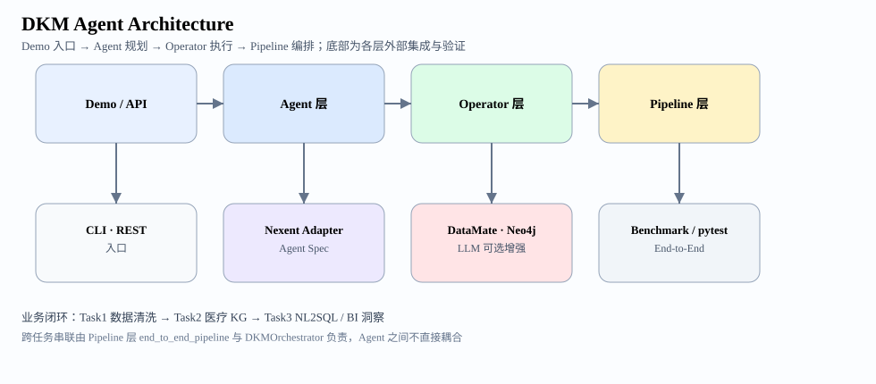

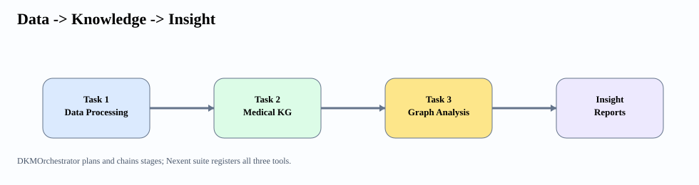

统一 Nexent 套件通过 `demos/dkm_nexent_spec.py` 导出三任务 tool spec；`demos/dkm_online_integration.py` 可通过 Nexent 官方 OpenAPI 服务接口导入三套任务 API、刷新工具目录，并在显式允许写入时创建和回查 DKM Agent；跨任务编排由 `demos/dkm_orchestrator_demo.py` 提供自然语言阶段规划与执行。**离线 Nexent toolchain 模拟**见 `demos/dkm_nexent_toolchain_demo.py`，按 Nexent 工具调用顺序执行三任务并输出 `nexent_toolchain_evidence.json`（证据见 `evidence/benchmarks/` 或 `generated_outputs/nexent_toolchain/`）。

**1.3 数据闭环**

```text
原始医疗文本
  → 任务一：清洗与规范化
  → 任务二：实体抽取 → 关系抽取 → 校验 → 建图 → 问答
  → 任务三：图统计/关联/趋势 → 中心性/社区/路径 → NL2SQL → 可视化与洞察报告
```

默认流程下，任务三在图谱缺失时会先自动执行任务一清洗与任务二建图，从而在默认路径上走通「数据→知识→洞察」完整闭环。

**1.4 演示 / 评测场景对照**

下文各节出现的节点/边数、准确率等，对应不同输入语料与验证目的，汇总对照如下：

| 场景 | 输入 | 典型结果 | 用途 | 主要章节 |
| --- | --- | --- | --- | --- |
| 任务二默认 demo / Neo4j | `task2_medical_notes.txt`（4 条内置样例） | 26 nodes / 29 edges | 建图与问答能否跑通；Neo4j 读回 | §3.3、§6.3 L4 |
| 端到端 demo | `task1_medical_notes.txt` → 串联（5 条） | 36 nodes / 37 edges | 三任务闭环 | §4.5 |
| 抽取质量评测 | 30 条人工标注病历 | 161/161 实体、145/145 关系 | 固定 gold 集上的 P/R/F1 | §3.2 |
| OOV 开放域评测 | 8 条词典外语料 | 词典外实体 **22/22**；封闭集 F1 1.0 | 词典 + 后缀模式混合 | §3.2.1 |
| 任务一 CSV demo / benchmark | `task1_patients.csv` | 5→4 行，质量分 0.8→1.0 | 结构化清洗与质量 benchmark | §2.2 |
| 任务一端到端文本 | `task1_medical_notes.txt`（5 条） | 5/5 行通过 | 文本清洗链路（供 §4.5 上游） | §4.5 |

**1.4.1 跨任务执行路径对照**

| 路径 | 层级 | 规划 | 执行 | 主要证据 |
| --- | --- | --- | --- | --- |
| `end_to_end_pipeline` | Pipeline | 固定三阶段 | 是 | `evidence/logs/end_to_end_demo.txt` |
| `DKMOrchestrator.run` | Agent | 关键词/LLM | 是 | `dkm_orchestrator_execute_evidence.json` |
| Nexent 三工具 toolchain | Nexent Adapter | 规则对比 | 是 | `nexent_toolchain_evidence.json` |
| `dkm_orchestrator_demo --plan-only` | Agent | 仅规划 | 否 | 规划 JSON（快速审阅） |

**1.5 智能体规划与 Nexent 集成证据（2026-07-03 增量）**

| 证据 | 说明 | 路径 |
| --- | --- | --- |
| 规则规划对比 | 三任务 rule vs hybrid 规划器算子列表 | `evidence/benchmarks/planner_comparison.json` |
| LLM 规划对比 | 规则基线 + LLM 增强（live 或录制快照） | `evidence/benchmarks/planner_llm_evidence.json` |
| Nexent toolchain | 三工具离线串联：task1 → task2 → task3 | `evidence/nexent_toolchain/nexent_toolchain_evidence.json` |

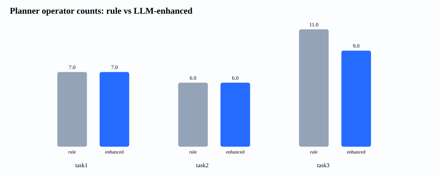

命令：`python demos/planner_llm_evidence_demo.py --llm`（有 `.local/llm_config.env` 时 live 采集，否则合并 `benchmarks/data/planner_llm_snapshot.json`）；`python demos/dkm_nexent_toolchain_demo.py`。

**1.6 DKM 编排器实跑证据（2026-07-03）**

除 Nexent 三工具 toolchain（§1.5）外，`DKMOrchestrator.run()` 在 Agent 层完成**规划 + 顺序执行**（task1 → task2 → task3），artifact 在阶段间传递：

| 证据 | 说明 | 路径 |
| --- | --- | --- |
| 编排器实跑 | NL 请求 → 规划 → 三阶段执行 + 图谱统计 | `evidence/benchmarks/dkm_orchestrator_execute_evidence.json` |
| DataMate 混合模板 | 本地填补缺失 + DataMate 去重/规范化分工 | `evidence/benchmarks/task1_datamate_hybrid_evidence.json` |

命令：`python demos/dkm_orchestrator_execute_evidence_demo.py`；`python demos/task1_datamate_hybrid_evidence_demo.py`。

---

## 二、任务一：数据处理智能体

**2.1 实现要点**

- 支持 CSV、JSON（记录转表）与非结构化文本三类输入
- 自动数据画像、算子规划与逐步执行（`OperatorScheduler`）
- DataMate 试运行 / 正式提交数据生成；外部服务不可用时自动降级
- REST API、Nexent agent spec、路径安全与 LLM 配置隔离

**2.2 运行验证摘录**

```
task1_data_processing_agent: completed
profile: 5 rows, 4 columns, 1 duplicate rows
operators: load_csv -> profile_schema -> drop_duplicate_rows ->
           fill_missing_values -> normalize_column_types ->
           export_clean_dataset -> validate_clean_dataset
cleaning: 4 rows exported
validation: passed / duplicates_ok=True / missing_ok=True
quality_report: passed / DataMate execution_mode=offline
```

完整日志见 `evidence/logs/task1_demo.txt`；清洗结果样例见 `evidence/artifacts/task1_patients_cleaned.csv`。

> 样例分工：本节与 §2.2 摘录来自 `task1_patients.csv`（结构化 CSV demo / 质量 benchmark）；§4.5 端到端 demo 上游使用 `task1_medical_notes.txt`（5 条文本），二者均为合法入口，见 §1.4。

任务一另提供数据质量基准测试：`benchmarks/task1_data_quality_benchmark.py`。当前报告 `benchmarks/reports/task1_data_quality.json` 显示，默认样例 CSV 在 3 次迭代中通过全部阈值，质量分从 0.8 提升到 1.0，重复行从 1 降到 0，缺失值从 3 降到 0。

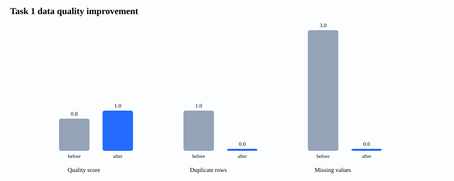

**2.3 本地小模型与 LLM 增强（可选）**

任务一支持 QLoRA 微调规划 adapter（`data/training/model_output`，3 epochs，eval_loss 0.0005123）。训练与推理共用同一 system prompt，详见 `../../docs/local_model_finetune.md`。LLM 增强路径（DeepSeek `deepseek-v4-flash`）已验证 `planner_mode=llm` 输出合法算子计划并完成清洗。

完整能力边界、复现命令与算子白名单见 任务一：数据处理智能体。

---

## 三、任务二：医疗知识图谱

**3.1 图谱构建流程**

1. 医疗实体抽取（词典 + 可选 LLM/本地 NER）
2. 关系抽取（`has_symptom`、`treated_by`、`diagnosed_by`、`recommended_treatment`、`complication_of`）
3. 三元组校验与图谱 JSON 导出
4. 图谱检索、单跳/多跳问答与证据链
5. 可选写入 Neo4j 5 Community

`complication_of` 关系仅在文本出现「并发」「合并」「继发于」等明确语义信号时生成，避免共现疾病产生不可解释边。

**3.2 抽取质量（人工标注评测）**

在独立于内置样例与训练数据的人工标注语料上评测（30 条病历，共 161 个标注实体）：

| 指标 | 数值 |
| --- | ---: |
| Precision | 1.000 |
| Recall | 1.000 |
| F1 | 1.000 |

各类别 F1 均为 1.000，实体 161/161 全部命中。关系级评测同样为 precision / recall / F1 = 1.000（145/145 条标注关系全部命中）。`treated_by` 采用显式药物-疾病配对优先、并发症感知和症状用药线索门控；新增反例测试保证并发疾病存在独立用药、同一药物存在多种用途时不会因整段病历共现而被误屏蔽。该结果只代表当前 30 条人工标注病历，不外推为开放医疗语料的医学权威准确率。语料文件见 `benchmarks/data/kg_extraction_gold.json`、`benchmarks/data/kg_relation_gold.json`；完整报告见 `evidence/benchmarks/task2_kg_extraction_quality.json`、`evidence/benchmarks/task2_relation_quality_rule.json` 与 `evidence/benchmarks/task2_relation_quality_cpu.json`（CPU 张量路径在 30 条标注病历上 P/R/F1=1.0）；真实语料张量正确性见 `evidence/benchmarks/task2_relation_tensor_real_corpus.json`。

**3.2.1 开放域 OOV 评测**

与 §3.2 的 30 条封闭 gold 分开，另设 8 条**词典外**语料（`benchmarks/data/kg_extraction_oov_gold.json`）。抽取链路在词典与别名匹配之外，增加 `pattern_extractor.py` 识别中文医疗后缀（如 …病、…综合征、…替丁、血*、活性测定），再与词典结果合并、最长匹配优先：

| 指标 | 封闭 30 条 gold | OOV 8 条 hold-out |
| --- | ---: | ---: |
| 实体 F1 | 1.000 | 1.000 |
| 词典外实体命中 | — | **22/22** |

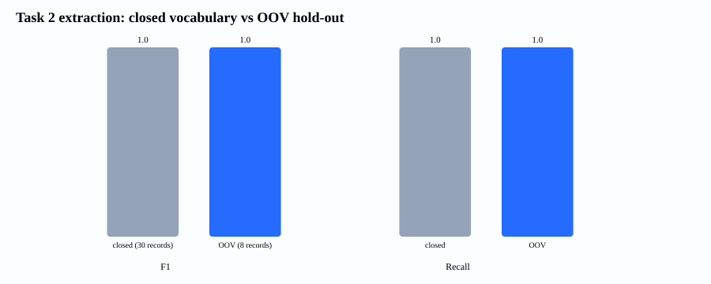

报告：`evidence/benchmarks/task2_oov_extraction_quality.json`；单测：`tests/test_pattern_extractor.py`。复现：`python benchmarks/task2_oov_extraction_benchmark.py`。

**3.2.2 端到端流水线时延（2026-07-03）**

除孤立算子 micro-benchmark 外，另测**完整任务二流水线**（实体抽取 → 关系抽取 → 校验 → 建图）在 4 条内置样例上的平均时延：

| 后端 | 平均时延 (ms) | 说明 |
| --- | ---: | --- |
| Rule pipeline | 见报告 | `extract_relations` 规则路径 |
| Tensor CPU pipeline | 见报告 | `extract_relations_tensorized(backend='cpu')` |

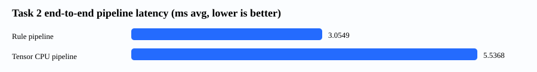

报告：`evidence/benchmarks/task2_pipeline_latency.json`；命令：`python benchmarks/task2_pipeline_latency_benchmark.py`。NPU 端到端时延需 Ascend 硬件，算子级加速见 §5 与 `task2_relation_tensor_*.json`。

**3.3 离线演示验证**

默认运行 `demos/task2_demo.py`，输入为 `data/samples/task2_medical_notes.txt`（4 条内置样例）。本节验证建图与问答能否跑通，不是 §3.2 的 30 条人工标注评测。

```
状态: completed
图谱: 26 nodes / 29 edges / 29 triples
问答: 高血压相关信息：症状: 头晕、头痛、气短、胸闷；用药: 氨氯地平、阿司匹林。
```

日志见 `evidence/logs/task2_demo.txt`；图谱 JSON 见 `evidence/artifacts/medical_kg.json`。

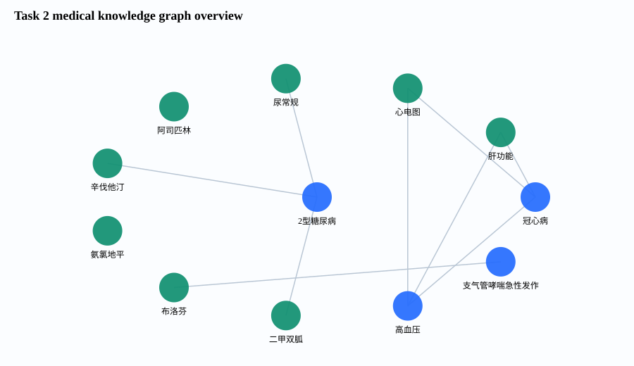


**3.4 Neo4j 真实持久化验证**

与 §3.3 同 4 条内置样例输入，Bolt 冒烟 `passed=true`，读回 **26 nodes / 29 edges**。离线 JSON：`evidence/benchmarks/task2_neo4j_live_smoke.json`；在线读回：`evidence/online_integration/task2-neo4j-live-smoke-20260702-final.json`（§6.3 L4）。

**3.4.1 环境与配置**

- 部署：`docker compose -f docker-compose.neo4j.yml up -d`
- 镜像：Neo4j 5 Community
- 连接：`bolt://localhost:7687`，账号 `neo4j`；密码由本地 `.env` / `NEO4J_AUTH` 配置提供，答辩材料不收录明文密码
- Python 驱动：neo4j 6.2.0

**3.4.2 冒烟测试结果（2026-07-03）**

| 检查项 | 结果 |
| --- | --- |
| 连接状态 | connected |
| 写入节点/边 | 26 / 29 |
| 读回节点/边 | 26 / 29 |
| 实体检索（高血压） | matched |
| Neo4j QA | answered |
| 综合结论 | 通过（passed: true） |

复现命令：

```bash
docker compose -f docker-compose.neo4j.yml up -d
python demos/task2_neo4j_live_smoke.py --password-file .local/neo4j.password
```

**3.4.3 Neo4j 查询结果示意（2026-07-03，26 / 29）**

下列 PNG 与 HTML 均由 `medical_kg.json` 渲染，与 `task2_neo4j_live_smoke.json` 读回一致；可直接用浏览器打开 **`evidence/html/neo4j_query_evidence.html`** 查看四条 Cypher 的表格与关系图（答辩正文 `competition_defense_document.html` 内嵌 PNG 预览）。

**图 1 — 节点入库总览**

查询语句：

```cypher
MATCH (n)
RETURN labels(n) AS 标签, n.name AS 名称, n.type AS 类型
LIMIT 25
```

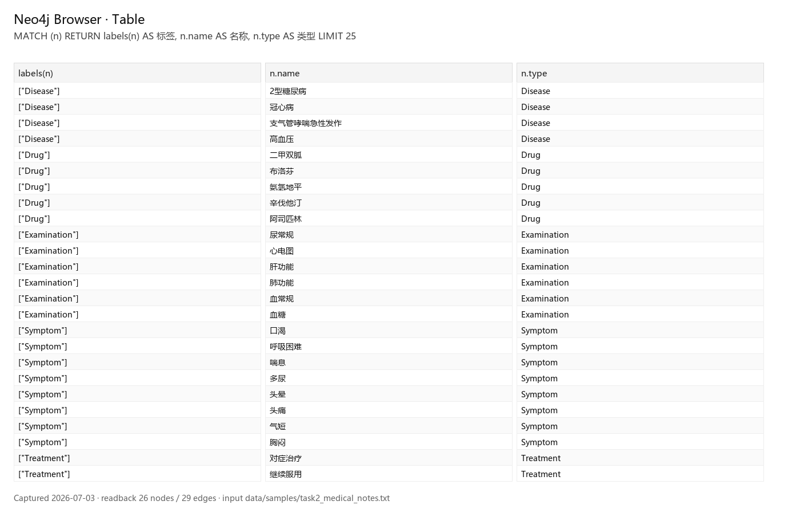

*说明：医疗实体已按 Disease / Drug / Examination 等标签写入图数据库，节点名称与业务类型字段与任务二 schema 一致。*

**图 2 — 以「高血压」为中心的关系查询（表格）**

```cypher
MATCH (d:Disease {name: '高血压'})-[r]->(t)
RETURN d.name AS 疾病, type(r) AS 关系, t.name AS 目标
LIMIT 20
```

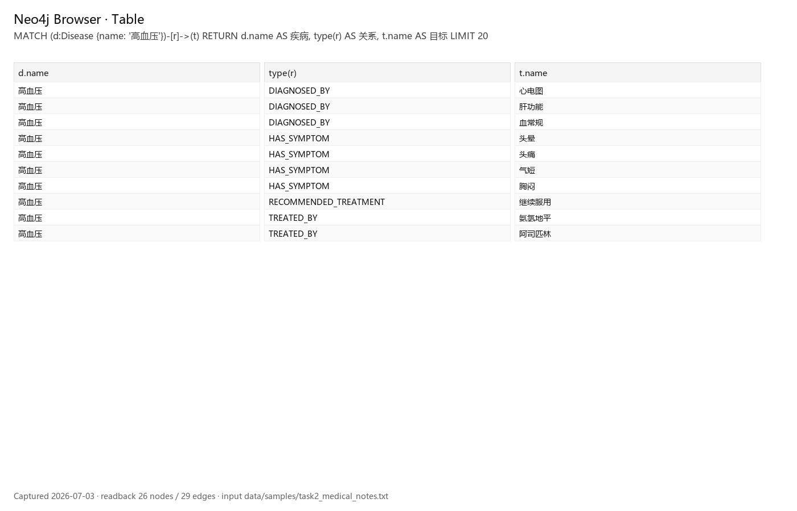

*说明：可见 HAS_SYMPTOM（头晕、头痛、胸闷、气短）、TREATED_BY（氨氯地平、阿司匹林）、DIAGNOSED_BY（血常规、肝功能、心电图）及 RECOMMENDED_TREATMENT（继续服用）等关系，与抽取 schema 及 QA 输出一致。*

**图 3 — 关系图视图**

```cypher
MATCH (d:Disease {name: '高血压'})-[r]->(t)
RETURN d, r, t
LIMIT 15
```

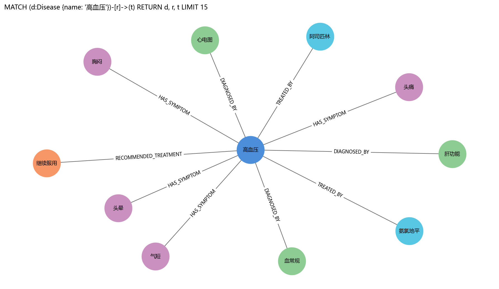

*说明：同一查询的图结构视图，展示疾病节点与症状、药物、检查等实体之间的有向关系。*

**图 4 — 节点类型分布**

```cypher
MATCH (n)
RETURN labels(n)[0] AS 类型, count(*) AS 数量
ORDER BY 数量 DESC
```

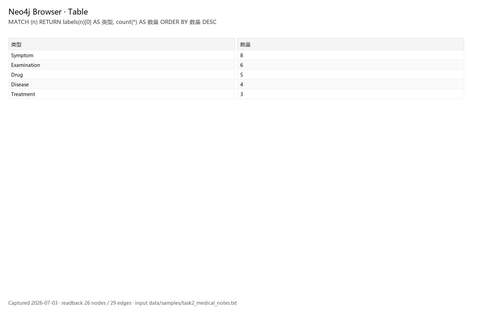

*说明：Symptom 8、Examination 6、Drug 5、Disease 4、Treatment 3，合计 26 节点，与 §3.3 离线图谱及在线读回一致。*

**3.5 LLM 增强（可选）**

LLM 增强路径已验证：配置 DeepSeek（`deepseek-v4-flash`）后，`planner=llm | LLM=active`，4 chunks processed by LLM，生成 39 triples，QA answered。本地小模型 NER adapter（`kg_model_output/final`，3 epochs，eval_loss 0.005754）同样验证 `local_model=active`。详见 `../../docs/local_model_finetune.md`。同一批 4 条内置样例上，规则 demo 默认规模为 §3.3 的 29 edges；LLM 路径 triple 数更多，属可选增强模式，各场景完整对照见 §1.4。

完整 schema、能力边界、Neo4j 适配与复现命令见 任务二：医疗知识图谱智能体。

---

## 四、任务三：图谱驱动分析

**4.1 分析能力**

- 图谱统计、疾病关联、趋势分析
- 图中心性、社区发现、枢纽间最短路径（按规划意图触发）
- NL2SQL：本地模型 / LLM / 模板三级翻译；字符串校验与 SQLite authorizer 双层限制只读图模式查询
- 静态 BI 仪表盘、ECharts 交互仪表盘、Markdown/HTML 洞察报告
- ECharts 采用固定版本异步增强，内嵌 SVG 首屏默认可见，断网时仍可直接阅读

图谱缺失时，默认会自动补全上游流程：任务一清洗 → 任务二建图 → 任务三分析。

**4.2 NL2SQL 评测结果**

模板路径（`classify_question_intent` + 固定 SQL 模板）在扩展意图集上的评测结果：

| 评测 | 测什么 | 结果 |
| --- | --- | ---: |
| 意图分类（76 题） | 自然语言 → 查询意图（含枢纽节点、症状/药物/疗法→疾病反查） | **76/76** |
| 执行级（18 题） | SQL 结果行与标准答案一致 | **18/18** |
| 改写回归（20 题） | 改写问法仍得到相同查询结果 | **20/20** |

完整报告见 `evidence/benchmarks/task3_nl2sql_report.json`（含 `independent_paths`：当前 template **18/18**，LLM/local 需配置后单独评测）。`nl2sql_holdout_benchmark.json` 为扩展改写回归集，不是独立盲测集。

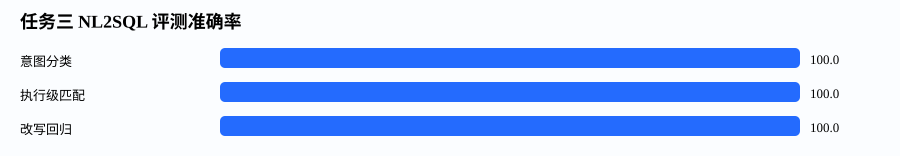

**4.3 运行验证摘录**

```
状态: completed
图谱: 26 nodes / 29 edges
枢纽节点: 高血压(11), 2型糖尿病(7), 冠心病(6)
NL2SQL: top_disease_symptoms（模板路径）
图表: entity_distribution, relation_distribution, record_trend, disease_network
质量: passed
```

日志见 `evidence/logs/task3_demo.txt`。

**4.4 可视化附图**

**实体类型分布**

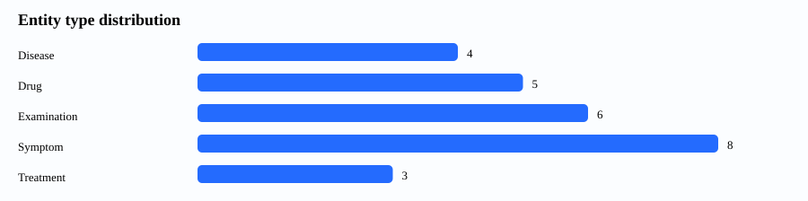

**关系类型分布**

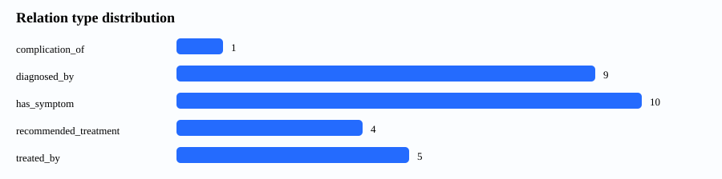

**疾病关联网络（摘录）**

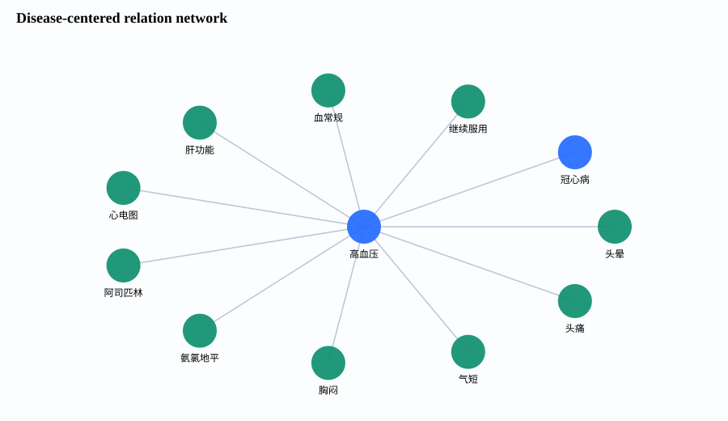

**记录趋势**

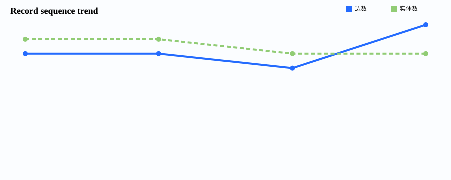

**ECharts 交互仪表盘（`task3_interactive_dashboard.html`）**

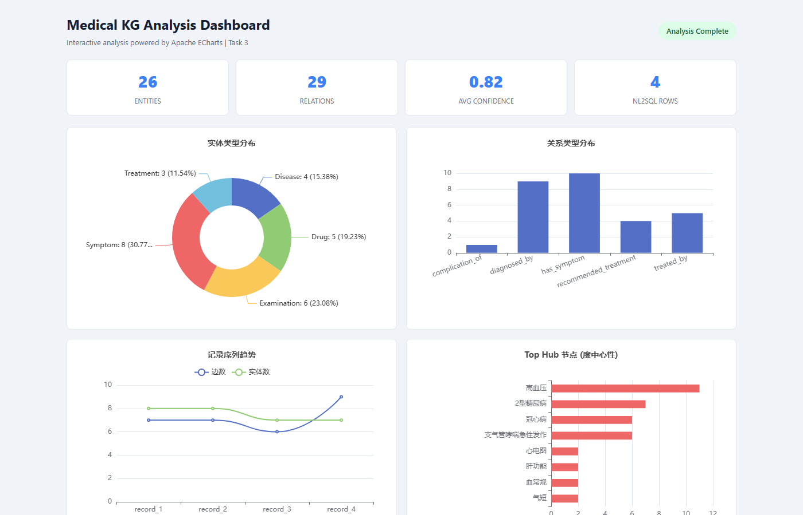

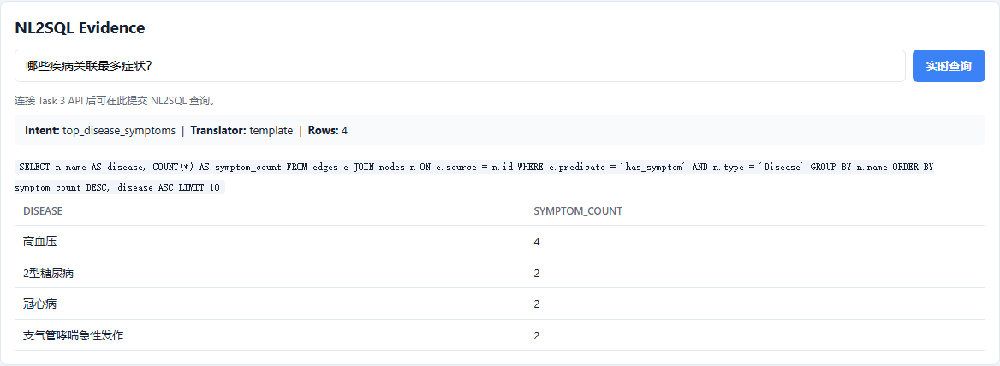

基于 §4.3 同一输入（`medical_kg.json`，4 条内置样例）的仪表盘读数如下：

| 指标 | 数值 |
| --- | --- |
| 实体 | 26 |
| 关系 | 29 |
| 平均置信度 | 0.82 |
| 记录序列趋势（边数 / 实体数） | record_1–4：7/8、7/8、6/7、9/7 |
| Top Hub（度中心性） | 高血压 11、2 型糖尿病 7、冠心病 6、支气管哮喘急性发作 6 |
| NL2SQL 示例问句 | 哪些疾病关联最多症状？ |
| 意图 / 路径 | `top_disease_symptoms`（模板） |
| 查询结果 | 4 行：高血压 4、2 型糖尿病 2、冠心病 2、支气管哮喘急性发作 2 |

完整交互页面见 `evidence/html/task3_interactive_dashboard.html`（四象限含关系分布、记录序列趋势双线、Top Hub 横向条；内嵌 SVG 首屏可离线阅读；连接任务三 API 后可实时 NL2SQL）。另含 `task3_analysis_dashboard.html`、`task3_insight_report.html`。

**4.5 端到端闭环**

`demos/end_to_end_demo.py` 按「原始语料 → 清洗文本 → 知识图谱 → 洞察报告」单向串联三任务；下游阶段消费上游产物，任一阶段失败则整条流水线标记失败。

| 阶段 | 输入 | 输出产物 | 核心验证 |
| --- | --- | --- | --- |
| 任务一 数据清洗 | `data/samples/task1_medical_notes.txt`（5 条） | 清洗文本 + 质量报告 | `quality_report.status=passed`；5/5 行，无缺失/重复 |
| 任务二 知识图谱 | 任务一清洗文本 | `medical_kg.json` | 36 nodes / 37 edges；KG QA「高血压有哪些症状和用药？」已回答并附 4 条证据边 |
| 任务三 图谱分析 | 任务二图谱 JSON | Markdown/HTML 报告 + 交互仪表盘 | NL2SQL 返回 2 行；扩展算子（中心性、最短路径、社区）与 11/11 计划算子均已执行 |
| 流水线汇总 | — | JSON 状态日志 | `status=completed`；三阶段均为 `completed` |

完整 JSON 见 `evidence/logs/end_to_end_demo.txt`；生成物见 `generated_outputs/end_to_end/`。各场景输入与指标对照见 §1.4。

**4.6 LLM 与本地小模型增强（可选）**

LLM 增强路径已验证：配置 DeepSeek 后 `planner=llm | NL2SQL=llm | LLM=active`，`nl2sql=llm_generated`，5 rows，quality passed。本地小模型两个 adapter（`analysis_planning_model_output/final` eval_loss 0.06268、`analysis_nl2sql_model_output/final` eval_loss 0.001397）均验证 `NL2SQL=local_model_generated` 并返回正确结果。详见 `../../docs/local_model_finetune.md`。

完整分析算子清单、NL2SQL 安全约束、可视化与复现命令见 任务三：图谱驱动分析智能体。

---

## 五、NPU 算子优化

**5.1 优化边界**

- 所有 NPU 结论均保留 CPU 基线对照；未检测到 NPU 时记录 `unavailable` 状态和原始报告
- 验证层次：运行时 → 设备适配 → 算子加速 → 业务路径集成
- 评测范围限于任务二/三的关键算子与业务子路径，完整流水线未作为整体加速对象
- NPU 证据已于 2026-06-24 在 Ascend 910B3（aarch64，CANN 8.5.0，npu-smi 25.5.0）上基于 `final-version` 分支复跑；关系级 NPU 质量历史快照 P/R/F1=1.0（46/46，10 条人工标注病历），30 条标注病历 CPU 张量路径本地复跑 P/R/F1=1.0（145/145）；任务二/任务三基准测试均含 `torch_npu`、`device=npu:0`，且正确性检查通过（`correctness.status=passed`）。

**5.2 Ascend 910B3 最新验证结果（2026-06-24）**

| 项目 | 结果 |
| --- | --- |
| 环境 | CANN 8.5.0 · torch 2.9.0+cpu · torch_npu 2.9.0 · npu-smi 25.5.0（aarch64） |
| 三套任务演示 | 全部通过 |
| pytest | **770/770 passed**，0 失败，369.30s（2026-06-16 历史为 380/380；2026-06-14 历史快照为 289/289） |
| NPU 专项 pytest | **43/43 passed**，21.60s |
| 任务二 relation tensor top-k（65k） | `cached_topk_labels` **61.64×**（对 full-format CPU），1.078 ms |
| 任务二 relation tensor xlarge | `cached_topk_labels` **99.95×**（对 full-format CPU），1.389 ms |
| 任务二关系级质量 | NPU P/R/F1=1.0（46 TP / 0 FP / 0 FN） |
| 任务三 graph tensor cached_bincount_topk | **27.77×**（5k/50k 图）；prepared kernel **7.98×** |
| 任务三业务路径 centrality | **1.16×**（5k/50k cached，`top_hubs_backend=torch_npu`） |
| NPU 能效采样 | xlarge 采样 44 次，利用率 0.0%–3.0%，功率 101.4–111.5W |

服务器完整说明见 `evidence/npu_summary.txt` 与 `../benchmarks/reports/ascend_910b2c_experiment_summary.md`。所有加速比均绑定表中工作负载、基线对照与缓存条件，不代表完整流水线整体加速。

## 六、工程质量与复现

**6.1 自动化检查**

| 检查项 | 结果 |
| --- | --- |
| `ruff check .` | 全部检查通过 |
| `python -m pytest -q` | **437/437** 通过，0 失败（2026-07-03 证据包，见 `evidence/logs/pytest.txt`） |

各环境 pytest 汇总（均为 0 失败）：

| 环境 | 通过/总计 | 耗时 | 日期 |
| --- | --- | --- | --- |
| Windows / Python 3.12 | **437/437** | 见 `evidence/logs/pytest.txt` | 2026-07-03 |
| Ascend 910B3 无卡预配置 | **737/737** | 57.87s | 2026-06-24 |
| Ascend 910B3 插卡全量 | **770/770** | 369.30s | 2026-06-24 |
| NPU 专项子集 | **43/43** | 21.60s | 2026-06-24 |

终端摘录见 `evidence/logs/ruff.txt`、`evidence/logs/pytest.txt`。

**6.2 已知环境与风险（pytest）**

Windows 默认临时目录可能因历史残留或 ACL 阻塞 pytest `tmp_path`；遇到该问题时可改用项目内可写的 `--basetemp`。用例总数随分支演进可能变化，以各环境 `python -m pytest --collect-only -q` 与运行输出为准。

**6.3 集成探测（最新 2026-07-02）**

集成验证按依赖层级自下而上：L1 任务 API 提供业务能力 → L2 DataMate 供任务一算子目录与提交 → L3 Nexent 编排三工具 → L4 Neo4j 持久化任务二图谱。2026-07-02 在线探测 `stack_status=ready`。

| 层级 | 组件 | 验证什么 | 结论 | 证据 |
| --- | --- | --- | --- | --- |
| L1 | Task1 API `:8000/health` | HTTP 200 + `status=healthy` | available | `probe-20260702-final.json` → `task_api_health.task1` |
| L1 | Task2 API `:8002/health` | HTTP 200 + 服务标识 | available | 同上 → `task_api_health.task2` |
| L1 | Task3 API `:8003/health` | HTTP 200 + 服务标识 | available | 同上 → `task_api_health.task3` |
| L2 | DataMate `:18000` | health + 核心 API 探测 3/3；submit 创建模板/任务并回查 | 已验证 | `probe-20260702-final.json`；`datamate-submit-20260702-final.json` |
| L3 | Nexent `:3000` | JWT 鉴权 + OpenAPI 三服务注册 + Agent 回查 | 已验证（48 tools，`status=verified`） | `probe-20260702-final.json` 等 |
| L4 | Neo4j Bolt | 连接/写入/读回/Cypher/KG QA | `passed=true`；26 nodes / 29 edges | `task2-neo4j-live-smoke-20260702-final.json` |

> L2 submit 证据来源：上表 L2「已验证」来自手动执行 `demos/dkm_online_integration.py --mode submit` 的 JSON（如 `datamate-submit-20260702-final.json`），不是默认 `collect_competition_evidence` 离线采集的产出。

**离线采集基线：** `collect_competition_evidence` 默认以 `--datamate-url none --nexent-url none --neo4j-uri none` 采集，集成报告为 `stack_status=offline`，外部服务均为 skipped（跳过）。离线 JSON 见 `evidence/integration_probes/`；在线证据见 `evidence/online_integration/`；Nexent 注册规格见 `evidence/nexent_specs/`。

> **2026-07-03 复验补充：** 本地全栈 probe（`probe-20260703-fullstack.json`）与 DataMate submit 复跑（`datamate-submit-20260703-rerun.json`）与 2026-07-02 结果一致；详见 `evidence/online_integration/README.md`。

Windows 侧 Nexent/DataMate 容器在 WSL Ubuntu + Docker 中运行；任务 API 在 Windows PowerShell 启动。原生 Linux 部署时 Nexent 容器访问宿主机 API 需配置 `host.docker.internal` 或 `--docker-host auto`，详见 `../../docs/online_integration.md`。部署边界见 `../../docs/preparation.md`。

NPU 服务器证据见 `evidence/npu_summary.txt` 与 `evidence/benchmarks/`（Ascend 910B3，2026-06-24 快照）。§6.3 中 L2 DataMate「已验证」来自 `dkm_online_integration` 手动 submit；证据采集器对 DataMate 仅试运行、Neo4j 采证加 `--skip-pipeline` 只读回查。Neo4j 密码经标准输入传递，命令清单与日志不保存密码。任务一 REST API 仅允许访问服务启动时配置的 DataMate 地址，且默认拒绝正式提交（`submit`）。

**6.4 复现命令**

演示（默认样例）：

```bash
python demos/task1_demo.py
python demos/task2_demo.py
python demos/task3_demo.py
python demos/end_to_end_demo.py
```

任务效果 benchmark（业务指标）：

```bash
python benchmarks/task1_data_quality_benchmark.py
python benchmarks/task2_extraction_quality_benchmark.py
python benchmarks/task3_nl2sql_benchmark.py
```

工程校验（pytest / ruff）：

```bash
python -m pytest -q
python -m ruff check .
```

可选 Neo4j live 冒烟（需 Docker + 凭据）：

```bash
python demos/task2_neo4j_live_smoke.py
```

---

## 七、总结

| 维度 | 结论 |
| --- | --- |
| 智能体编排 | DKM 编排器实跑三阶段 + Nexent toolchain + LLM/规则规划对比证据齐全 |
| 架构 | Agent / Operator / Pipeline 分层清晰，Nexent spec 与安全在线导入链路完整，真实导入与 Agent 回查已验证 |
| 闭环 | 数据→知识→洞察在默认流程与端到端演示中均可完整跑通 |
| 结果质量 | 封闭 gold 161/161、145/145；OOV 语料词典外实体 **22/22**；NL2SQL 意图 **76/76**、执行 **18/18**、改写 **20/20** |
| 增强路径 | 三任务 LLM 增强（DeepSeek，复现命令见各任务文档中的 `deepseek-v4-flash` 配置）与本地小模型（4 个 QLoRA adapter，3 epochs）均已完成训练并通过验证，详见各任务文档与 `../../docs/local_model_finetune.md` |
| 图数据库 | Neo4j 2026-07-02 冒烟测试 `passed=true`（见 `evidence/online_integration/task2-neo4j-live-smoke-20260702-final.json`，26 nodes / 29 edges）；§3.4 PNG + `evidence/html/neo4j_query_evidence.html` 与读回一致（4 条内置样例） |
| 工程 | ruff 无告警；Windows pytest **437/437**（2026-07-03 证据包）；NPU 服务器 770/770（2026-06-24 快照，`final-version`） |
| NPU | 算子级公平基线对照与 Ascend 910B3 快照齐全；一键脚本 `benchmarks/scripts/run_npu_full_verify.sh`（`cached_topk_labels` 99.95×、`cached_bincount_topk` 27.77×、centrality 1.16×） |

本材料保留离线回归、Nexent、DataMate、Neo4j 与 NPU 的原始证据。证据日期分层：Windows 代码与 pytest 以 2026-07-03 证据包为准（**437/437**）；非 NPU 在线集成以 2026-07-02 JSON 为准；NPU 以 Ascend 910B3 2026-06-24 JSON 与 `evidence/npu_summary.txt` 为准。更早日期（2026-06-14/15/16/18）数值见对应 JSON 快照，同名文件可能已被后续复跑覆盖。WSL 与 Linux 部署边界见 `../../docs/preparation.md`、`../../docs/online_integration.md`。推荐浏览器打开 `competition_defense_document.html`；复现命令见 `../../README.md` 与 `../../docs/competition_defense_outline.md`。

> **2026-07-03 更新摘要：** 后缀模式 OOV **22/22**；NL2SQL 扩展至 **76/76** 意图、**18/18** 执行；pytest **437/437**；Nexent toolchain 与 LLM 规划证据入包。**2026-07-02：** 30 条封闭 gold benchmark 与在线集成 JSON。**2026-06-24：** NPU 770/770 快照。

---

## 附录 A：常见问题

| 问题 | 说明 |
| --- | --- |
| 无 Docker 能否复现？ | 可以。默认 JSON 图谱与全部自动化测试可离线自证；Neo4j 为在线集成补充证据。 |
| NL2SQL 是否仅匹配关键词？ | 模板路径覆盖 76 题意图、18 题执行与 20 题改写回归；开放表达可由本地模型或 LLM 路径补充，报告内 `independent_paths` 单独记录各路径结果。 |
| 医学结论是否权威？ | 本项目目标是可解释的医疗语义图谱，不构成临床诊疗建议。 |
| NPU 覆盖范围是什么？ | 当前提供特定算子与业务子路径的 CPU/NPU 基线对照数据，完整流水线未作为整体加速对象。 |
| Windows 本地 pytest 能否作为最终证据？ | 可以作为本地代码基线，但需标注环境并保留完整日志；若默认临时目录受限，再使用干净 `basetemp`。NPU 相关结论仍以 Ascend 服务器的独立复跑和 JSON 报告为准。 |

## 附录 B：证据文件索引

| 文件 | 内容 |
| --- | --- |
| `competition_defense_document.html` | 自包含答辩报告（图片 base64 内嵌） |
| `competition_defense_document.md` | 答辩正文打包副本（仓库源稿：`docs/competition_defense_document.md`） |
| `evidence/screenshots/neo4j/*.png` | Neo4j 四类 Cypher 查询结果 PNG 示意 |
| `evidence/screenshots/task3/*.png` | 任务三 ECharts 交互仪表盘截图 |
| `evidence/figures/*.svg` | 架构/闭环、OOV 对比、流水线时延、规划对比、任务 SVG 图表 |
| `evidence/html/neo4j_query_evidence.html` | Neo4j 四条 Cypher 查询结果 HTML（可浏览器直接打开） |
| `evidence/html/task3_*.html` | 任务三洞察报告与 ECharts 交互仪表盘 |
| `evidence/benchmarks/*.json` | 抽取 / OOV / NL2SQL / 规划对比 / 编排器实跑 / Neo4j 冒烟测试 |
| `evidence/nexent_toolchain/*.json` | Nexent 三工具离线串联证据 |
| `evidence/logs/*.txt` | 演示程序与 pytest 终端摘录 |
| `evidence/npu_summary.txt` | Ascend 910B3 NPU 复跑摘要 |
| `evidence/integration_probes/*.json` | 外部服务探测 |
| `evidence/online_integration/*.json` | Nexent OpenAPI 导入、工具刷新与 Agent 回查证据 |
| `evidence/nexent_specs/*.json` | Nexent agent 注册规格 |
| `evidence/artifacts/medical_kg.json` | 任务二图谱样例 |
