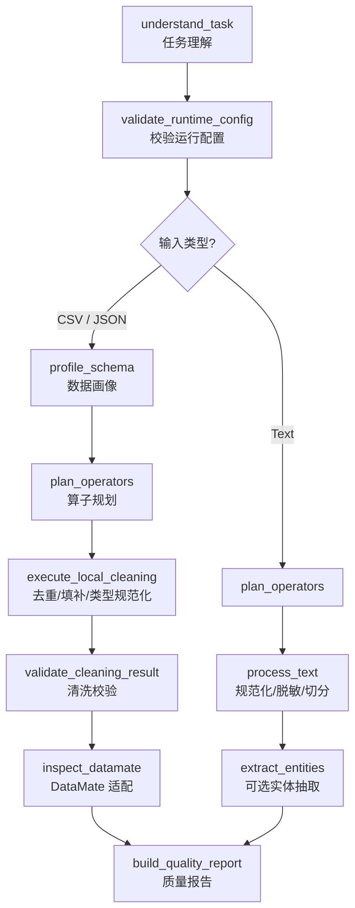

# 任务一：数据处理智能体

> 把原始医疗数据整理成"可被知识抽取稳定消费"的结构化/半结构化产物。
> **可规划 · 可执行 · 可追踪** ｜ 默认样例质量分 `0.8 → 1.0` ｜ 重复行 `1 → 0` ｜ 缺失值 `3 → 0` ｜ 无外部依赖即可复现

## 目录

- [1. 总体规划与作用](#1-总体规划与作用)
- [2. 操作流程](#2-操作流程)
- [3. 模块分别介绍](#3-模块分别介绍)
- [4. 使用代码](#4-使用代码)
- [5. 结果比对](#5-结果比对)
- [安全与边界](#安全与边界)

---

## 1. 总体规划与作用

任务一承担整条链路的第一段：让智能体**先理解数据处理需求，再结合输入画像选择算子，最后执行、记录状态并产出质量报告**。它不是几个孤立的清洗函数，而是一个"可规划、可执行、可追踪"的数据处理闭环。后续任务二可以直接复用任务一清洗出的文本或表格。

### 样例文件分工

| 样例 | 用途 |
| --- | --- |
| `data/samples/task1_patients.csv` | 默认 demo、质量 benchmark、最小复现（§5）；5→4 行 |
| `data/samples/task1_medical_notes.txt` | 端到端 demo 上游文本清洗（5 条）；见答辩 §4.5 |

一个典型请求的递进：用户提出"清洗患者 CSV、去重、填补空值并导出" → `DataProcessingAgent` 识别任务类型和数据类型 → 对 CSV 做画像 → 根据画像补齐去重、缺失值填补、类型规范化等算子 → 执行并校验。若 DataMate 服务可用，还会读取算子目录，把本地算子映射为可提交的模板/任务数据；默认只生成试运行证据，不自动写入远端。

### 能力概览

| 维度 | 内容 |
| --- | --- |
| **输入** | CSV（`.csv`）、JSON records（`.json`）、非结构化文本（`.txt` / `.text`） |
| **输出** | 清洗后的数据集、数据质量报告、DataMate 试运行/正式提交记录、可选实体 CSV |
| **核心能力** | 任务理解 → 自动规划 → 状态追踪 → 确定性清洗 → 质量校验 → 平台适配 |
| **增强层** | 本地小模型规划、LLM 规划、DataMate 集成、Nexent/REST API |
| **闭环定位** | 链路第一段，产物供任务二建图复用 |

### 在 DKM 闭环中的位置

<div align="center">


</div>

---

## 2. 操作流程

智能体根据输入扩展名自动选择处理路径；不支持的格式返回明确错误，不会静默跳过。

### 主流程

<div align="center">



</div>

### 流程阶段与产物

| 输入类型 | 扩展名 | 处理过程 | 主要产物 |
| --- | --- | --- | --- |
| CSV 结构化数据 | `.csv` | 画像 → 规划 → 去重/填补/类型规范化 → 校验 → DataMate 提交数据 | 清洗 CSV、质量报告、DataMate 试运行/正式提交记录 |
| JSON records | `.json` | records 展平为 CSV → 复用 CSV 清洗路径 | 中间 CSV、清洗结果、质量报告 |
| 非结构化文本 | `.txt` / `.text` | 文本规范化 → 脱敏 → 记录切分 → 可选实体抽取 | 清洗文本、实体 CSV、质量报告 |

> **算子白名单**：当前注册算子为 `load_csv`、`profile_schema`、`drop_duplicate_rows`、`drop_column`、`fill_missing_values`、`normalize_column_types`、`export_clean_dataset`、`validate_clean_dataset`、`load_text`、`clean_text`、`extract_entities`、`transform_columns`。规划器（含 LLM / 本地模型）只能选择这些已注册算子，避免输出无法执行的步骤。

---

## 3. 模块分别介绍

任务一按"入口 Agent → 规划器 → 调度器 → 算子 → 平台适配"组织。读代码可从 `src/pipelines/task1_data_pipeline.py` 进入，再下钻到 `DataProcessingAgent`。

### 分层架构

| 层次 | 代码入口 | 职责 |
| --- | --- | --- |
| Agent 编排 | `src/agents/data_processing_agent/agent.py` | 接收任务、判断输入类型、组织运行步骤并汇总产物 |
| 任务理解与规划 | `src/agents/data_processing_agent/planner.py` | 将自然语言请求和数据画像转换为 `TaskUnderstanding` 与 `DataTaskPlan` |
| 执行与状态 | `scheduler.py`、`state.py` | 按 DAG 或顺序执行算子，记录 `pending/running/completed/failed` |
| 数据算子 | `src/operators/data_ops/` | CSV 画像、清洗、文本处理、字段转换和 DataMate client |
| 报告与质量 | `reporting.py` | 输出数据质量、执行步骤、DataMate 状态和复现证据 |
| 外部入口 | `task1_api_server.py`、`nexent_adapter.py` | 提供 REST API，导出 Nexent 兼容 tool / agent spec |

这种拆分让规则清洗、本地小模型规划、LLM 规划、DataMate 对接和 Nexent 注册互不绑死：无外部服务时规则基线仍能跑通，有服务时增强能力只在对应层生效。

### 执行层能力边界

| 层级 | 何时使用 | 承担职责 | 失败后的行为 |
| --- | --- | --- | --- |
| 规则基线 | 默认路径，无需外部依赖 | 关键词意图识别、CSV 画像驱动规划、确定性清洗和文本脱敏 | 作为最终回退方案，保证演示和测试可复现 |
| 本地小模型 | 传入 `--local-model` 且 adapter 存在 | 用 Qwen2.5-0.5B QLoRA adapter 预测算子计划 | 计划无效或模型不可用时回退 LLM 或规则 |
| LLM 规划 | 传入 `--llm --llm-config` | 调用 OpenAI 兼容 API 生成规划，输出仍按白名单过滤 | API 不可用、算子不足或配置缺失时回退 |
| DataMate API | `datamate_url` 可达时 | 读取算子目录，构造模板/任务提交数据，必要时提交并回查 | 不影响本地主链路，状态进入 warning 或 waiting |
| Nexent / REST API | 服务化或评审集成时 | 将任务一能力暴露为 OpenAPI 工具并生成 Nexent 配置 | 本地命令行和流水线仍可直接运行 |

文档中的 `planner_mode`、`datamate.status` 和 REST API 结果，正是用来区分这些层级是否实际启用。

### 关键实现细节

**CSV 清洗**：先按整行相等检测并删除重复记录，再按列画像填补缺失值——整数列填 `0`、浮点列填 `0.0`、布尔列填 `false`、文本列或空列填 `unknown`；导出前把整数、浮点、布尔规范成一致的字符串表示。导出文件会再次画像，用于验证重复行和缺失单元格已处理。

**文本处理**：面向医疗笔记类非结构化输入——移除 HTML 标签、把全角数字/字母规范为 ASCII、把电话号码与身份证号脱敏为 `[PHONE]` 和 `[ID_CARD]`。记录按 `---` 或双换行切分；若任务要求实体抽取，规则关键词识别疾病、药品、检查项目，导出 `record_id`、`diseases`、`drugs`、`examinations` 四列 CSV。

**DataMate 集成（读写分离）**：先 `GET /api/health` 确认可达，再 `POST /api/operators/list` 读取算子目录；本地算子按 `configs/task1_datamate.yaml` 的保守关键词映射为 DataMate 算子。默认 `datamate_mode=dry_run` 只生成映射和提交数据证据；真实提交须显式切到 `submit` 并提供源数据集 id，提交后用返回的资源 ID 回查，只有 `status=verified` 才表示服务端确认。DataMate 未启动时仍返回数据画像和计划产物，状态为 `completed_with_warnings`。

| 本地算子 | DataMate 处理方式 |
| --- | --- |
| `drop_duplicate_rows` | 可用时映射到 `DuplicateFilesFilter` 和 `DuplicateSentencesFilter` |
| `fill_missing_values` | 仅本地执行（当前 DataMate 算子目录无表格字段填补算子） |
| `normalize_column_types` | 映射到 `UnicodeSpaceCleaner`、`ExtraSpaceCleaner` 等文本规范化算子 |

**Nexent 集成**：不修改官方 Nexent 仓库，本项目提供轻量 adapter。`DataProcessingAgentTool` 按 smolagents tool 形态暴露 `name`、`description`、`inputs`、`output_type`、`forward(...)`；`build_nexent_tool_spec()` 与 `build_nexent_agent_spec()` 生成可导入配置。可导入 Nexent SDK 时返回真实 Pydantic config，否则返回同构字典，让本地演示/测试/取证不依赖外部平台。

**小模型微调**：用 Qwen2.5-0.5B 经 QLoRA 微调本地规划模型。训练数据由规则规划器生成，共 1600 条样本，覆盖 56 个请求模板和 10 类数据画像；LoRA 默认 rank 16、alpha 32，target modules 为 `q_proj/k_proj/v_proj/o_proj`，默认 adapter 输出到 `data/training/model_output/`。训练细节见 [本地小模型微调与验证](local_model_finetune.md)。

---

## 4. 使用代码

以下命令均在项目根目录执行。临时演示输出写入 `outputs/`；可提交的长期基准报告写入 `benchmarks/reports/`；涉及 DataMate/Nexent 的在线命令需要本地服务和凭据已就绪。
Windows PowerShell 执行含中文参数的命令前，建议先启用 UTF-8，避免问题文本被转成 `????`：

```powershell
chcp 65001
$env:PYTHONUTF8="1"
```

### 快速开始

```powershell
python demos/task1_demo.py `
  --input data/samples/task1_patients.csv `
  --task "请清洗患者CSV，删除重复记录，填补空值，并统一字段类型后导出" `
  --output-dir outputs/task1
```

预期产物：`outputs/task1/task1_patients_cleaned.csv`、质量报告和运行摘要；默认样例不依赖外部服务即可复现。

### 分场景命令

```powershell
# CSV 清洗（自定义任务描述）
python demos/task1_demo.py `
  --input data/samples/task1_patients.csv `
  --task "请清洗患者CSV，删除重复记录，填补空值，并统一字段类型后导出" `
  --output-dir outputs/task1_csv

# 文本处理
python demos/task1_demo.py `
  --input data/samples/task1_medical_notes.txt `
  --task "清洗文本数据，去除HTML标签和特殊字符" `
  --output-dir outputs/task1_text

python demos/task1_demo.py `
  --input data/samples/task1_medical_notes.txt `
  --task "处理医疗文本，抽取诊断和药品信息" `
  --output-dir outputs/task1_text_entities

# 质量评测和长期基准测试报告
python demos/task1_evaluate.py `
  --input data/samples/task1_patients.csv `
  --task "请清洗患者CSV，删除重复记录，填补空值" `
  --output-dir outputs/task1_eval `
  --report-path outputs/task1/task1_quality_report.json

python benchmarks/task1_data_quality_benchmark.py `
  --input data/samples/task1_patients.csv `
  --iterations 5 `
  --output-dir outputs/task1_benchmark `
  --report benchmarks/reports/task1_data_quality.json

# 测试（只验证任务一相关用例）
python -m pytest tests/test_task1_data_agent.py -v
```

### 最小复现命令

以下命令只覆盖任务一，不依赖 DataMate、Nexent、Neo4j、LLM 或 NPU：

```powershell
$env:PYTEST_ADDOPTS="--basetemp=$PWD\.pytest_basetemp_task1_repro"

python demos/task1_demo.py `
  --input data/samples/task1_patients.csv `
  --task "请清洗患者CSV，删除重复记录，填补空值，并统一字段类型后导出" `
  --output-dir outputs/repro/task1

python benchmarks/task1_data_quality_benchmark.py `
  --input data/samples/task1_patients.csv `
  --iterations 3 `
  --output-dir outputs/repro/task1_benchmark `
  --report benchmarks/reports/task1_data_quality.json

python demos/task1_evaluate.py `
  --input data/samples/task1_patients.csv `
  --task "请清洗患者CSV，删除重复记录，填补空值" `
  --output-dir outputs/repro/task1_eval `
  --report-path outputs/repro/task1/task1_quality_report.json

python -m pytest tests/test_task1_data_agent.py -q
```

预期产物：`outputs/repro/task1/task1_patients_cleaned.csv`、`outputs/repro/task1/task1_quality_report.json`、`benchmarks/reports/task1_data_quality.json`。

增强路径需具备对应前置条件。DeepSeek 配置块是一次性本地模板；若
`.local/llm_deepseek_v4.env` 已存在，可跳过模板创建，直接执行后续演示命令：

```powershell
# DeepSeek V4 LLM 辅助规划：真实 key 只写 ignored 本地文件，不提交
New-Item -ItemType Directory -Force .local | Out-Null
@"
OPENAI_API_KEY=<your-deepseek-api-key>
OPENAI_BASE_URL=https://api.deepseek.com
OPENAI_MODEL=deepseek-v4-flash
OPENAI_THINKING=disabled
OPENAI_TIMEOUT=120
OPENAI_MAX_TOKENS=2048
"@ | Set-Content -Encoding UTF8 .local\llm_deepseek_v4.env

python demos/task1_demo.py --llm --llm-config .local/llm_deepseek_v4.env `
  --datamate-url none --output-dir outputs/task1_deepseek_v4

# 预期：planner_mode: llm；输出 task1_patients_cleaned.csv 和质量报告

# 本地小模型规划：需要 adapter 目录已存在
python demos/task1_demo.py --local-model data/training/model_output `
  --datamate-url none --output-dir outputs/task1_local_model

# 预期：planner_mode: local_model；若模型输出不合规，仍按白名单回退并完成清洗

# DataMate 试运行：只生成提交数据证据，不写远端
python demos/task1_demo.py --datamate-url http://localhost:18000 --datamate-mode dry_run --output-dir outputs/task1_datamate_dry_run
```

### 小模型训练（需训练依赖，GPU 训练 / CPU 推理）

```powershell
python data/training/generate_training_data.py
python src/training/finetune_small_model.py --model-name "<BASE>"
python demos/task1_demo.py --local-model data/training/model_output
```

`<BASE>` 为 ModelScope 下载的基座目录，见 [local_model_finetune.md](local_model_finetune.md) §1。

### REST API

```powershell
python demos/task1_demo.py --serve --host 127.0.0.1 --port 8000
```

> API server 默认监听 `127.0.0.1`，仅在可信网络中才显式使用 `--host 0.0.0.0`。

| 方法 | 路径 | 用途 |
| --- | --- | --- |
| GET | `/health` | 健康检查 |
| GET | `/api/task1/operators` | 列出已注册算子 |
| POST | `/api/task1/process` | 提交处理任务 |
| GET | `/api/task1/status/{task_id}` | 查询任务状态 |
| GET | `/api/task1/report/{task_id}` | 获取任务报告 |

DataMate 任务提交数据需要已有源数据集 id：

```python
run_task1_pipeline(
    datamate_src_dataset_id="...",
    datamate_src_dataset_name="patients",
    datamate_dest_dataset_name="patients_cleaned",
)
```

未提供 `datamate_src_dataset_id` 时，DataMate task 产物停留在 `waiting_for_dataset`。

### DataMate 与任务一在线集成

只读就绪探测：

```powershell
python scripts/datamate_readiness.py `
  --url http://localhost:18000 `
  --timeout 8
```

任务一 DataMate 试运行复现，不写远端：

```powershell
python demos/task1_demo.py `
  --input data/samples/task1_patients.csv `
  --datamate-url http://localhost:18000 `
  --datamate-mode dry_run `
  --output-dir outputs/task1_datamate_dry_run
```

可信网络中启动任务一 API；默认仍禁止请求侧 DataMate 写入：

```powershell
python demos/task1_demo.py `
  --serve `
  --host 0.0.0.0 `
  --port 8000 `
  --datamate-url http://localhost:18000
```

只有确认 DataMate source dataset ID 且允许创建清洗任务时，才执行 submit。CSV 表格清洗中的缺失值填补属于本地算子；DataMate 远端 submit 证据应使用 DataMate 支持的文本清洗算子并回查模板/任务资源：

```powershell
$srcDatasetId="<existing-datamate-source-dataset-id>"
$destName="task1_submit_smoke_cleaned_$(Get-Date -Format yyyyMMddHHmmss)"
@"
import json
from pathlib import Path
from src.operators.data_ops.datamate_client import DataMateClient

client = DataMateClient("http://localhost:18000", timeout=8)
summary = client.catalog_summary(
    ["drop_duplicate_rows", "normalize_column_types"],
    src_dataset_id="$srcDatasetId",
    src_dataset_name="task1_submit_smoke",
    dest_dataset_name="$destName",
    mode="submit",
)
result = {
    "template_status": summary["cleaning_template"]["submission"]["status"],
    "template_resource_id": summary["cleaning_template"]["submission"]["resource_id"],
    "task_status": summary["cleaning_task"]["submission"]["status"],
    "task_resource_id": summary["cleaning_task"]["submission"]["resource_id"],
    "dest_dataset_name": "$destName",
}
Path("outputs/task1_datamate_submit").mkdir(parents=True, exist_ok=True)
Path("outputs/task1_datamate_submit/datamate_submit.json").write_text(
    json.dumps(result, ensure_ascii=False, indent=2) + "\n",
    encoding="utf-8",
)
print(json.dumps(result, ensure_ascii=False, indent=2))
if result["template_status"] != "verified" or result["task_status"] != "verified":
    raise SystemExit(1)
"@ | python -
```

`$srcDatasetId` 必须替换为 DataMate 中已存在的 source dataset ID；该命令会创建远端清洗模板和任务，不属于无前置条件的本地离线复现命令。提交结果必须包含 `template_status=verified`、`task_status=verified` 和对应 `resource_id`，才能作为真实在线成功证据；`submitted_unverified` 只能说明请求已发出，不能说明服务端资源已回查确认。

### 依赖

按运行场景安装三层依赖之一，详见 [依赖与环境](dependencies.md)：

```powershell
python -m pip install -r requirements.txt       # 通用：任务一/二/三主链路 + 本地小模型训练/推理
python -m pip install -r requirements-dev.txt   # 开发：叠加测试与代码检查
python -m pip install -r requirements-npu.txt   # NPU：Ascend，需先激活 CANN + torch_npu；本轮非 NPU 复验不执行
```

模型 API key 从 `.env` 或 `.json` 配置读取（`src/common/llm_config.py` 同时支持），不写入受版本控制的文件。

---

## 5. 结果比对

### 数据质量（默认样例 `data/samples/task1_patients.csv`）

| 指标 | 清洗前 | 清洗后 |
| --- | ---: | ---: |
| 行数 | 5 | 4 |
| 重复行 | 1 | 0 |
| 缺失值 | 3 | 0 |
| 质量分 | 0.80 | 1.00 |

证据来源：`benchmarks/task1_data_quality_benchmark.py` → `benchmarks/reports/task1_data_quality.json`。`demos/task1_evaluate.py` 默认写入 `outputs/task1/task1_quality_report.json`（本地运行证据）；可提交的长期基准写入 `benchmarks/reports/`。

### 结论边界

- 任务一基准测试**不声明 NPU 加速**，仅用于量化数据质量提升、验证清洗算子链路和记录平均运行耗时。
- 小模型和 LLM 在此作为**规划增强路径**，不将其表述为相对规则清洗的量化提升；其量化质量仍以规则基线的数据质量基准测试为准（训练 loss、合法计划输出见 [本地小模型微调与验证](local_model_finetune.md)）。
- `outputs/` 是运行时证据目录，已被 Git 忽略。

---

## 安全与边界

- **DataMate 写入受控**：默认 `dry_run`（试运行），只有显式 `submit` 才会修改 DataMate 后端。`base_url` 必须是绝对 `http(s)` URL 且不含嵌入式凭据；任务一 API 将 DataMate 地址固定到服务启动参数，单个请求不能改写目标地址；写入权限为服务端启动级配置（`--allow-api-datamate-write`），不能由单个请求开启。
- **凭据不落盘**：LLM 配置仅在运行时读取，生成报告只记录状态和 planner 元数据，不含 API key。
- **路径校验**：REST API 中类似路径的字段经 `src/common/path_security.py` 校验，本地路径必须位于项目工作区或系统临时目录内。
- **产物隔离**：运行产物放 `outputs/`，本地配置放 `.local/`，模型权重、日志和私有数据集均被 Git 忽略。

> **实现要点**：`DataProcessingAgent`、planner、scheduler、data operators、pipeline、演示程序和测试互相解耦；运行产物可见任务理解、数据画像、算子计划、执行状态和失败报告。CSV、JSON 记录、文本处理、DataMate 试运行和 REST API 均可通过本文命令复现。

---

## 端到端与在线集成（摘要）

任务一清洗产物供任务二建图；三任务串联入口为 `demos/end_to_end_demo.py`（编排见 `src/pipelines/end_to_end_pipeline.py`）。阶段表与验证要点见答辩 [§4.5 端到端闭环](competition_defense_document.md)；各场景输入与结果见 §1.4。

DataMate 在线验证属于集成 **L2**（2026-07-02 已验证）；完整 L1–L4 表见 [在线集成](online_integration.md) 与答辩 [§6.3 集成探测](competition_defense_document.md)。

---

## 关联文档

- **答辩材料**：[技术答辩材料](competition_defense_document.md) §二「任务一：数据处理智能体」汇总实现要点与运行验证；§4.5 / §6.3 分别汇总端到端闭环与在线集成结论。
- **本地小模型微调**：[本地小模型微调](local_model_finetune.md) 详述 QLoRA 训练流程、常见问题与修复记录及最新训练指标（任务一规划 adapter 3 epochs，eval_loss 0.0005123）。
- **部署记录**：[初步准备与部署记录](preparation.md) 说明 Python 3.12 依赖与可选服务（DataMate/Neo4j）的启动方式。
- **架构总览**：[架构说明](architecture.md) 给出 Agent / Operator / Pipeline 分层与 Nexent Adapter 的接口契约。
