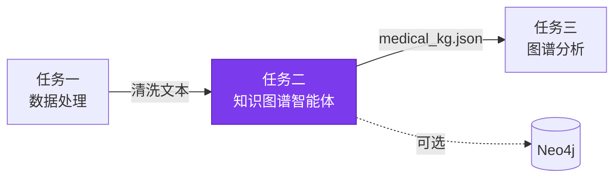
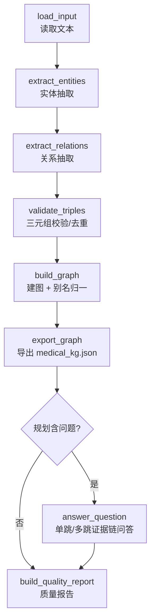

# 任务二：医疗知识图谱智能体

> 把任务一清洗后的医疗文本组织成可查询、可问答、可追溯的医疗知识图谱。
> **实体 P/R/F1 = 1.000（161/161，30 条人工标注病历）** ｜ **关系 P/R/F1 = 1.000（145/145，30 条人工标注病历）** ｜ 每条边保留 record id + 置信度 + evidence ｜ 默认无外部依赖即可复现

## 目录

- [1. 总体规划与作用](#1-总体规划与作用)
- [2. 操作流程](#2-操作流程)
- [3. 模块分别介绍](#3-模块分别介绍)
- [4. 使用代码](#4-使用代码)
- [5. 结果比对](#5-结果比对)
- [安全与边界](#安全与边界)

---

## 1. 总体规划与作用

任务二是系统从"数据"进入"知识"的核心阶段。任务一负责把原始文本/表格整理干净，任务二则要把其中的**疾病、症状、药物、检查、治疗方案**组织成可查询的医疗知识图谱，并让问答智能体基于图谱证据回答问题。其产物 `medical_kg.json` 也是任务三做统计、NL2SQL 和可视化分析的输入。

链路递进：从医疗文本抽取实体 → 按医学语义规则或增强模型生成关系候选 → 用 schema 做校验和去重 → 构建节点、边和 evidence snippet 都可追溯的图谱。问答不在原文上直接生成，而是先落到图谱查询和证据链，再组织答案。

### 能力概览

| 维度 | 内容 |
| --- | --- |
| **输入** | 医疗文本（任务一清洗产物或样例 `task2_medical_notes.txt`） |
| **输出** | 图谱 JSON（`medical_kg.json`）、单跳/多跳问答结果、证据链、质量报告 |
| **核心能力** | 实体抽取 → 关系抽取 → 三元组校验 → 建图 → 图谱检索 → 证据链问答 |
| **增强层** | 本地小模型 NER、LLM 增强抽取/规划、Neo4j 持久化、NPU 张量算子、REST/Nexent API |
| **闭环定位** | 链路第二段，承接任务一文本，产出供任务三分析 |

### 在 DKM 闭环中的位置

<div align="center">



</div>

---

## 2. 操作流程

任务二主流程线性，但每一步都留下可检查产物。

### 主流程

<div align="center">



</div>

### 流程阶段说明

| 阶段 | 算子 | 说明 |
| --- | --- | --- |
| 抽取 | `extract_entities`、`extract_relations` | 覆盖 `Disease/Symptom/Drug/Examination/Treatment` 实体与 `has_symptom/treated_by/diagnosed_by/recommended_treatment/complication_of` 关系 |
| 校验 | `validate_triples` | schema 合法性校验与去重；`complication_of` 仅在出现"并发/合并/继发于"等明确信号时生成 |
| 建图 | `build_graph` | 别名归一（如 `糖尿病 → 2型糖尿病`）；边保留 record id、置信度、evidence snippet |
| 问答 | `answer_question` | 由规划驱动：仅构建/查询意图且无问题时跳过；带问题的计划才执行 |

> **规划驱动执行**：规划器优先级为 `local_model > LLM > rule-based`。完整建图会执行抽取/关系/校验/建图/QA/质量报告；查询型任务可复用已有 `medical_kg.json`，避免重复重建。

---

## 3. 模块分别介绍

任务二分为"图谱生成"（知识从哪里来）和"图谱使用"（知识如何被问答和分析复用）两部分。

### 分层架构

| 层次 | 代码入口 | 职责 |
| --- | --- | --- |
| Agent 编排 | `src/agents/kg_agent/agent.py` | 读取文本，调用抽取/校验/建图/问答算子并汇总运行证据 |
| 任务规划 | `src/agents/kg_agent/planner.py` | 判断完整建图 / 图谱查询 / 问答任务，输出可执行算子序列 |
| 图谱 schema | `configs/task2_kg_schema.yaml` | 约束实体类型、关系类型和三元组合法性 |
| 抽取算子 | `entity_extractor.py`、`relation_extractor.py`、`llm_extractor.py`、`local_model_ner.py` | 实体和关系候选生成，支持规则、LLM、本地模型（回退优先级见 [架构说明](architecture.md)） |
| 构建与查询 | `triple_validator.py`、`graph_builder.py`、`query.py`、`qa.py`、`multi_hop_qa.py` | 校验、去重、建图、实体检索、邻接查询、多跳证据链 |
| 可选图数据库 | `neo4j_store.py`、`neo4j_query.py` | JSON 图谱持久化到 Neo4j，并用 Cypher 查询 |
| 外部入口 | `task2_kg_pipeline.py`、`task2_api_server.py`、`nexent_adapter.py` | pipeline、REST API、Nexent 注册规格 |

默认路径不依赖外部服务，从样例文本直接得到 JSON 图谱和 QA 结果；Neo4j、LLM、本地模型、NPU 都是增强层。

### 能力边界（同一套 schema 与质量报告，评测方式一致）

| 层级 | 何时使用 | 承担职责 | 失败后的行为 |
| --- | --- | --- | --- |
| 规则基线 | 默认路径 | 词典实体抽取、规则关系生成、schema 校验、建图、模板 QA | 确定性主链路，无外部依赖也能复现 |
| 本地小模型 | `--local-model` 且模型目录存在 | 参与 KG 规划，用本地 NER adapter 补充规则未覆盖实体 | 模型缺失/推理失败时回退规则或 LLM |
| LLM 增强 | 传入 `.local/llm_config.env` 或 JSON | 增强实体/关系抽取、规划、多跳答案组织；与规则结果合并 | 调用失败时保留规则抽取，不中断主链路 |
| Neo4j | 传入 `--neo4j-uri` 和本地密码 | 图谱写入图数据库，提供实体/邻居/路径/QA 的 Cypher 查询 | 不可用时回退 JSON 图谱和内存查询 |
| REST / Nexent API | `--serve` 或导出 spec | 导出为 OpenAPI 工具供 Nexent 编排 | 命令行和流水线仍可本地运行 |
| NPU 算子 | 关系张量基准测试或 NPU 后端 | 对关系候选打分的张量化子算子做 CPU/NPU 对比 | 不改变语义；不可用时保留 CPU/规则路径 |

### 关键实现细节

**问答分层**：单跳问题围绕疾病节点查询症状、药物、检查、治疗方案；多跳问题用 BFS 在实体间查找路径，把路径上的边组织成 evidence chain。配置 LLM 时，LLM 只增强答案表达或补充抽取，图谱证据仍来自已校验的节点和边。

**Neo4j 后端（可选）**：启用 `--neo4j-uri` 后，`persist_neo4j` 用 MERGE 写入节点和边；`neo4j_find_entities`、`neo4j_query_neighbors`、`neo4j_multi_hop`、`neo4j_answer_question` 使用原生 Cypher。节点标签映射为 `Disease/Symptom/Drug/Examination/Treatment`，关系映射为 `HAS_SYMPTOM/TREATED_BY/DIAGNOSED_BY/RECOMMENDED_TREATMENT/COMPLICATION_OF`。不可达时回退 JSON 图谱和内存查询，不影响离线复现。

### 模块目录

```text
src/agents/kg_agent/
  agent.py              Agent 编排，支持 LLM 和本地模型
  planner.py            混合规划器（规则 / LLM / 本地模型）
  nexent_adapter.py     Nexent tool / agent spec 构建器
src/operators/kg_ops/
  entity_extractor.py   词典型医疗实体抽取
  relation_extractor.py 规则三元组生成
  triple_validator.py   schema 校验和去重
  graph_builder.py      节点/边图谱构建
  query.py / qa.py / multi_hop_qa.py   检索、单跳 QA、多跳证据链
  llm_extractor.py / local_model_ner.py   LLM 与本地模型增强
  neo4j_store.py / neo4j_query.py         Neo4j 持久化与 Cypher 查询
  reporting.py          KG 就绪度和指标报告
src/operators/npu_ops/
  kg_benchmark.py       CPU 基准测试和 NPU 运行时探测
  kg_tensor_ops.py      关系张量打分 CPU/NPU 算子
src/pipelines/         task2_kg_pipeline.py / task2_api_server.py / task2_evaluation.py
configs/task2_kg_schema.yaml      data/samples/task2_medical_notes.txt
```

---

## 4. 使用代码

以下命令均在项目根目录执行。临时演示输出写入 `outputs/`；可提交的长期基准报告写入 `benchmarks/reports/`；Neo4j 和 Nexent 在线命令需要本地服务和凭据已就绪。
Windows PowerShell 执行含中文问题的命令前，建议先启用 UTF-8，避免 `--question` 被转成 `????` 造成 QA `unanswered`：

```powershell
chcp 65001
$env:PYTHONUTF8="1"
```

### 快速开始

```powershell
python demos/task2_demo.py `
  --input data/samples/task2_medical_notes.txt `
  --output-dir outputs/task2 `
  --question "高血压有哪些症状和用药？"
```

预期产物：`outputs/task2/medical_kg.json`、问答结果、图谱质量报告；规则基线不依赖外部服务。

### 分场景命令

```powershell
# 指定输入和问题
python demos/task2_demo.py `
  --input data/samples/task2_medical_notes.txt `
  --output-dir outputs/task2_question `
  --question "高血压有哪些症状和用药？"

# 复用已有图谱查询，避免重复建图
python demos/task2_demo.py `
  --graph-file outputs/task2/medical_kg.json `
  --question "糖尿病需要做什么检查？" `
  --output-dir outputs/task2_query

# 评测与抽取质量基准
python demos/task2_evaluate.py `
  --input data/samples/task2_medical_notes.txt `
  --output-dir outputs/task2_eval `
  --question "糖尿病需要做什么检查？" `
  --report-path outputs/task2/task2_quality_report.json

python benchmarks/task2_extraction_quality_benchmark.py `
  --gold benchmarks/data/kg_extraction_gold.json `
  --report benchmarks/reports/task2_kg_extraction_quality.json

python benchmarks/task2_relation_quality_benchmark.py `
  --backend rule `
  --report benchmarks/reports/task2_relation_quality_rule.json

python benchmarks/task2_oov_extraction_benchmark.py `
  --report benchmarks/reports/task2_oov_extraction_quality.json

python benchmarks/task2_pipeline_latency_benchmark.py `
  --report benchmarks/reports/task2_pipeline_latency.json

python benchmarks/task2_kg_benchmark.py `
  --input data/samples/task2_medical_notes.txt `
  --iterations 20 `
  --skip-npu-probe `
  --report benchmarks/reports/task2_kg_benchmark.json

# CPU 关系张量基准测试（非 NPU 复验；Ascend NPU 命令见下方独立小节）
python benchmarks/task2_relation_tensor_benchmark.py `
  --candidate-count 65536 `
  --feature-dim 256 `
  --relation-count 5 `
  --iterations 20 `
  --prefer-device cpu `
  --benchmark-modes all `
  --profile-breakdown `
  --report benchmarks/reports/task2_relation_tensor_cpu.json

# 真实语料张量正确性（CPU 张量路径 vs 规则三元组）
python benchmarks/task2_relation_tensor_benchmark.py `
  --real-corpus data/samples/task2_medical_notes.txt `
  --prefer-device cpu `
  --report benchmarks/reports/task2_relation_tensor_real_corpus.json

# Nexent agent spec 输出
python demos/task2_nexent_spec.py --model-name main_model --output-dir outputs/task2

# 测试
python -m pytest tests/test_task2_kg_agent.py -q
python -m pytest tests/test_task2_benchmark.py -q
```

Ascend NPU 服务器上强制使用 NPU 后端复验任务二（**推荐直接跑一键脚本** `bash benchmarks/scripts/run_npu_full_verify.sh`，以下为分步命令）：

```bash
cd /path/to/nexent-dkm-agent
source /data/npu_env.sh
python -m pip install -r requirements-npu.txt
python demos/task2_demo.py --relation-backend npu --output-dir outputs/npu/task2
python benchmarks/task2_relation_tensor_benchmark.py --candidate-count 65536 --feature-dim 256 --relation-count 5 --iterations 20 --prefer-device npu --benchmark-modes all --profile-breakdown --report benchmarks/reports/task2_topk_65k.json
python -m pytest tests/test_task2_kg_agent.py tests/test_task2_benchmark.py tests/test_npu_kg_tensor_ops.py -q
```

### 最小复现命令

以下命令只覆盖任务二，不依赖外部 Nexent、DataMate、Neo4j、LLM 或 NPU：

```powershell
$env:PYTEST_ADDOPTS="--basetemp=$PWD\.pytest_basetemp_task2_repro"

python demos/task2_demo.py `
  --input data/samples/task2_medical_notes.txt `
  --output-dir outputs/repro/task2 `
  --question "高血压有哪些症状和用药？"

python demos/task2_evaluate.py `
  --input data/samples/task2_medical_notes.txt `
  --output-dir outputs/repro/task2_eval `
  --question "糖尿病需要做什么检查？" `
  --report-path outputs/repro/task2/task2_quality_report.json

python benchmarks/task2_extraction_quality_benchmark.py `
  --gold benchmarks/data/kg_extraction_gold.json `
  --report benchmarks/reports/task2_kg_extraction_quality.json

python benchmarks/task2_relation_quality_benchmark.py `
  --gold benchmarks/data/kg_relation_gold.json `
  --backend rule `
  --report benchmarks/reports/task2_relation_quality_rule.json

python benchmarks/task2_oov_extraction_benchmark.py `
  --report benchmarks/reports/task2_oov_extraction_quality.json

python -m pytest tests/test_task2_kg_agent.py tests/test_task2_benchmark.py -q
```

预期产物：`outputs/repro/task2/medical_kg.json`、`outputs/repro/task2/task2_quality_report.json`、`benchmarks/reports/task2_kg_extraction_quality.json`、`benchmarks/reports/task2_relation_quality_rule.json`、`benchmarks/reports/task2_oov_extraction_quality.json`。

增强路径需具备对应前置条件。DeepSeek 配置块是一次性本地模板；若
`.local/llm_deepseek_v4.env` 已存在，可跳过模板创建，直接执行后续演示命令：

```powershell
# DeepSeek V4 LLM 增强抽取：真实 key 只写 ignored 本地文件，不提交
New-Item -ItemType Directory -Force .local | Out-Null
@"
OPENAI_API_KEY=<your-deepseek-api-key>
OPENAI_BASE_URL=https://api.deepseek.com
OPENAI_MODEL=deepseek-v4-flash
OPENAI_THINKING=disabled
OPENAI_TIMEOUT=120
OPENAI_MAX_TOKENS=2048
"@ | Set-Content -Encoding UTF8 .local\llm_deepseek_v4.env

python demos/task2_demo.py --input data/samples/task2_medical_notes.txt `
  --llm-config .local/llm_deepseek_v4.env `
  --question "高血压有哪些症状？" `
  --output-dir outputs/task2_deepseek_v4

# 预期：[Mode] planner=llm | LLM=active；[LLM] 4 chunk(s) processed by LLM；生成 medical_kg.json

# 本地小模型 NER 抽取：需要 adapter 目录已存在
python demos/task2_demo.py --local-model data/training/kg_model_output/final `
  --question "糖尿病有哪些症状？" `
  --output-dir outputs/task2_local_model

# 预期：[Mode] local_model=active；生成 medical_kg.json

# 自然语言任务请求驱动计划
python demos/task2_demo.py --task-request "构建知识图谱并回答问题" --question "高血压需要做什么检查？" --output-dir outputs/task2_plan
```

### 小模型训练

```powershell
python data/training/generate_kg_training_data.py
python -m src.training.finetune_kg_model `
  --train-data data/training/kg_extraction_train.jsonl `
  --val-data data/training/kg_extraction_val.jsonl `
  --model-path "<BASE>" `
  --output-dir data/training/kg_model_output --epochs 3
```

`<BASE>` 为 ModelScope 下载的基座目录，见 [local_model_finetune.md](local_model_finetune.md) §1。

### REST API v2.0

```powershell
python demos/task2_demo.py --serve --host 127.0.0.1 --port 8002
curl http://127.0.0.1:8002/health
curl http://127.0.0.1:8002/api/task2/operators
```

如需供 Nexent 容器访问，可信本机网络中可监听 `0.0.0.0`：

```powershell
python demos/task2_demo.py --serve --host 0.0.0.0 --port 8002
```

| 方法 | 路径 | 用途 |
| --- | --- | --- |
| `GET` | `/health` | 服务健康检查 |
| `GET` | `/api/task2/operators` | 列出全部算子（13 个） |
| `POST` | `/api/task2/process` | 运行图谱生成和问答 |
| `GET` | `/api/task2/status/{task_id}` | 读取执行状态 |
| `GET` | `/api/task2/report/{task_id}` | 读取流水线产物 |
| `POST` | `/api/task2/query` | 查询图谱邻居 |
| `POST` | `/api/task2/multi-hop` | 多跳路径查找 |
| `POST` | `/api/task2/evidence-qa` | 证据链问答 |
| `POST` | `/api/task2/evidence-chain` | 构建证据链 |

请求示例：

```json
// POST /api/task2/process
{
  "input_path": "data/samples/task2_medical_notes.txt",
  "question": "高血压有哪些症状和用药？",
  "task_request": "构建医疗知识图谱",
  "llm_config_path": ".local/llm_config.env",
  "local_model_path": null
}

// POST /api/task2/multi-hop
{ "task_id": "<task-id>", "start_entity": "高血压", "target_entity": "阿司匹林", "max_hops": 3, "max_paths": 5 }

// POST /api/task2/evidence-qa
{ "task_id": "<task-id>", "question": "高血压和冠心病有什么关系？", "max_hops": 2 }
```

### 可选在线验证

以下步骤需要外部服务或凭据，**不是自动化测试的必要条件**，用于提供更强的真实集成证据。

**Neo4j 在线冒烟测试**（需 Docker + `neo4j` 包，已用 driver 6.2.0 + Neo4j 5 Community 验证）：

> Docker 入口：Windows 上若 PowerShell 无 `docker` 命令，请在 WSL Ubuntu 或已配置 PATH 的 Docker Desktop CLI 中执行下列 `docker compose`；与 [部署记录](preparation.md#windows--wsl-开发环境重要) 一致。

```powershell
# 1. 准备本地凭据（不要提交 .env 或 .local/neo4j.password）
Copy-Item .env.example .env
New-Item -ItemType Directory -Force .local | Out-Null
Set-Content -Path .local\neo4j.password -Value "<strong-password>"
# 2. 启动 Neo4j 并等待 Bolt 7687 就绪（首次 10-30 秒）
docker compose -f docker-compose.neo4j.yml up -d
# 3a. 一键证据采集（连接 + 持久化 + Cypher + QA）
python demos/task2_neo4j_live_smoke.py --password-file .local/neo4j.password --report benchmarks/reports/task2_neo4j_live_smoke.json
# 3b. 或直接运行演示
python demos/task2_demo.py --input data/samples/task2_medical_notes.txt --question "高血压有哪些症状和用药？" `
  --neo4j-uri bolt://localhost:7687 --neo4j-user neo4j --neo4j-password-file .local/neo4j.password
# 4. Neo4j Browser 验证：http://localhost:7474 ；5. 清理：docker compose -f docker-compose.neo4j.yml down
```

Neo4j Browser 可执行的人工复核 Cypher：

```cypher
MATCH (n) RETURN labels(n) AS labels, count(*) AS count ORDER BY count DESC;
MATCH (d:Disease {name: "高血压"})-[r]->(n) RETURN d.name, type(r), n.name LIMIT 25;
MATCH p=(d:Disease {name: "高血压"})--(n) RETURN p LIMIT 25;
```

预期：演示状态出现 `neo4j: completed / nodes=N / edges=M`，或报告中 `"passed": true`。2026-07-02 在线读回与 §3.3 默认 demo 同 4 条内置样例输入，Bolt 冒烟 `passed=true`，读回 **26 nodes / 29 edges**；节点标签分布 Symptom 8 / Examination 6 / Drug 5 / Disease 4 / Treatment 3。离线 JSON 见 `evidence/benchmarks/task2_neo4j_live_smoke.json`；在线 JSON 见 `evidence/online_integration/task2-neo4j-live-smoke-20260702-final.json`（答辩 §3.4、§6.3）。

> 驱动兼容：neo4j-driver 6.x 在 `Session.run()` 保留 `query` 关键字，故 `neo4j_find_entities` 用 `search_term` 作为 Cypher 参数名；Neo4j 5+ 字符串长度用 `size()`，不用已弃用的 `length()`。

**LLM 在线演示**（需 `.local/llm_deepseek_v4.env` 或同结构 JSON，含 base_url、api_key、model_name）：

```powershell
python demos/task2_demo.py --input data/samples/task2_medical_notes.txt `
  --llm-config .local/llm_deepseek_v4.env `
  --question "高血压有哪些症状和用药？" `
  --output-dir outputs/task2_llm_online
```

预期：终端出现 `planner=llm`、`LLM=active`、`4 chunk(s) processed by LLM`，且 `[QA] answered`，答案包含 `头晕`、`头痛`、`气短`、`胸闷`、`氨氯地平`、`阿司匹林` 中的图谱证据。若 PowerShell 管道或脚本内联中文被编码成 `????`，QA 会找不到“高血压”实体并返回 `unanswered`；此时应先执行上方 UTF-8 前置，或用命令行直接传参。DeepSeek V4 需设置 `OPENAI_THINKING=disabled`，否则 reasoning token 可能消耗预算并导致正文为空。

### 依赖

见 [依赖与环境](dependencies.md)。`neo4j`、`openai`、`transformers/peft/torch` 均为可选增强，缺失时自动回退本地 JSON 图谱与规则路径。

---

## 5. 结果比对

### 抽取质量（规则基线，人工标注语料可复现评测）

| 指标 | 实体级 | 关系级 |
| --- | ---: | ---: |
| Precision | 1.000 | 1.000 |
| Recall | 1.000 | 1.000 |
| F1 | 1.000 | 1.000 |
| 计数 | 161 / 161 | 145 / 145 |

证据来源：`benchmarks/data/kg_extraction_gold.json` + `benchmarks/data/kg_relation_gold.json`（30 条人工标注病历，独立于内置样例与训练数据），报告位于 `benchmarks/reports/task2_kg_extraction_quality.json` 和 `benchmarks/reports/task2_relation_quality_rule.json`。CPU 张量路径在 30 条标注病历上复跑见 `benchmarks/reports/task2_relation_quality_cpu.json`。`treated_by` 的显式药物-疾病归属、并发症门控、同药多用途均有测试覆盖。

### 开放域 OOV 评测

与上文 30 条封闭 gold 分开，另设 8 条词典外语料（`benchmarks/data/kg_extraction_oov_gold.json`）。抽取时在词典匹配之外增加 `pattern_extractor.py`（中文医疗后缀），再合并结果：

| 指标 | 封闭 30 条 gold | OOV 8 条 hold-out |
| --- | ---: | ---: |
| 实体 F1 | 1.000 | 1.000 |
| 词典外实体命中 | — | **22/22** |

报告：`benchmarks/reports/task2_oov_extraction_quality.json`；单测：`tests/test_pattern_extractor.py`。

```powershell
python benchmarks/task2_oov_extraction_benchmark.py --report benchmarks/reports/task2_oov_extraction_quality.json
```

### NPU 关系张量算子（Ascend 910B3，65k 候选）

| 对比口径 | 加速比 |
| --- | ---: |
| `cached_topk_labels` 对比 full-format CPU 基线 | 61.64× |

证据来源：`benchmarks/reports/task2_topk_65k.json`（`cached_topk_labels speedup_vs_cpu=61.6367`，1.078 ms，correctness=passed）、`benchmarks/reports/task2_relation_quality_ascend_910b2c_npu.json`（P/R/F1=1.0，46/0/0）。历史 2026-06-16 口径（910B2C）为 72.84×，同名 JSON 已被 2026-06-24 复跑覆盖。

### 结论边界

- 实体/关系的 P/R/F1 来自**规则基线在人工标注语料上**的可复现评测，**只代表当前 30 条标注病历，不外推为开放医疗语料的普遍准确率**。
- OOV 8 条语料词典外实体 **22/22**，与封闭 gold 分开报告，不外推为任意开放语料。
- 本地小模型和 LLM 记录的是"可接入、可回退、可输出合法结构"的增强证据，**不将其表述为相对规则基线的量化提升**。
- NPU 报告只评价**关系张量打分子算子**，绑定指定工作负载与缓存口径，不改变图谱语义，也**不声明完整知识图谱流水线已整体加速**。自 2026-07-03 起 `extract_relations_tensorized(backend="npu")` 默认走 `cached_argmax_labels` 路径，跳过全量 logits 回拷。
- 医疗抽取结果用于展示可解释的医疗语义图谱，**不构成临床诊疗建议**。

---

## 安全与边界

- **凭据不落盘**：LLM 抽取/规划/QA 只用 `src/common/llm_config.py` 运行时加载器，API key 不写入图谱或报告产物。
- **Neo4j 写入白名单**：使用白名单实体标签和关系类型，未知标签降级为 `Entity`，未知关系过滤条件被拒绝。证据采集器通过标准输入向冒烟测试子进程传递密码，并对命令/stdout/stderr 脱敏；`docker-compose.neo4j.yml` 从 ignored `.env` 读取 `NEO4J_AUTH`，仓库不提供固定数据库密码。
- **路径校验**：REST API 中类似路径的字段经 `src/common/path_security.py` 校验，必须位于项目工作区或系统临时目录内。
- **产物隔离**：运行产物放 `outputs/`，本地配置放 `.local/`，模型权重、日志和私有数据集均被 Git 忽略。新增图数据库、向量数据库或模型依赖前需单独确认。

> **实现要点**：文本 → 图谱 → 问答的完整链路，Agent / Operator / Pipeline / 演示 / Test 分层明确；三元组和边保留来源片段、record ID 与置信度，别名归一到规范节点。外部服务不可用时回退 JSON 图谱和规则基线，主质量指标仍以可复现评测为准。

---

## 端到端与在线集成（摘要）

任务二图谱 JSON 供任务三分析；三任务串联见 `demos/end_to_end_demo.py` 与答辩 [§4.5 端到端闭环](competition_defense_document.md)。各场景输入与典型结果见 §1.4。

Neo4j 在线验证属于集成 **L4**（2026-07-02 读回 26/29）；L1–L4 完整表见 [在线集成](online_integration.md) 与答辩 [§6.3 集成探测](competition_defense_document.md)。

---

## 关联文档

- **答辩材料**：[技术答辩材料](competition_defense_document.md) §三「任务二：医疗知识图谱」汇总图谱构建、抽取质量与 Neo4j 验证；§4.5 / §6.3 分别汇总端到端闭环与在线集成结论。
- **本地小模型微调**：[本地小模型微调](local_model_finetune.md) 详述 KG NER adapter（`kg_model_output/final`，3 epochs，eval_loss 0.005754）的训练流程。
- **部署记录**：[初步准备与部署记录](preparation.md) 说明 Neo4j 5 Community 的 Docker 启动与 `.env` 配置。
- **架构总览**：[架构说明](architecture.md) 给出 Agent / Operator / Pipeline 分层与 Nexent Adapter 的接口契约。
