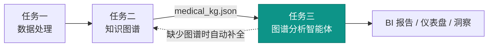
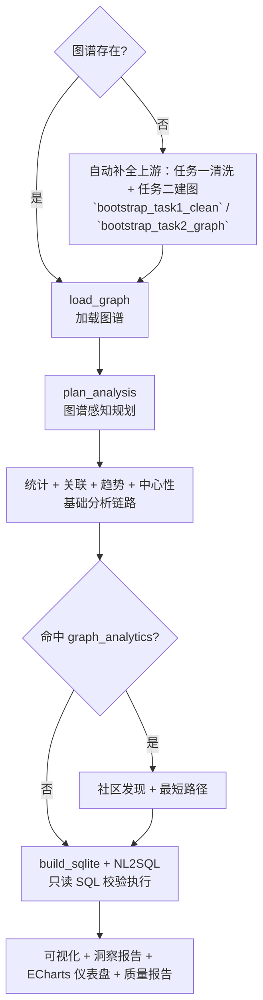

# 任务三：图谱驱动分析智能体

> 把任务二知识图谱转成可解释的分析洞察，是"知识 → 洞察"阶段。
> NL2SQL 意图 **76/76** · 执行 **18/18** · 改写 **20/20** ｜ 只读 SQL + SQLite authorizer ｜ 缺图谱时自动补全上游

## 目录

- [1. 总体规划与作用](#1-总体规划与作用)
- [2. 操作流程](#2-操作流程)
- [3. 模块分别介绍](#3-模块分别介绍)
- [4. 使用代码](#4-使用代码)
- [5. 结果比对](#5-结果比对)
- [安全与边界](#安全与边界)

---

## 1. 总体规划与作用

任务三负责把任务二生成的知识图谱转成可解释的分析洞察。它不是把 CSV 直接画成普通图表，而是先理解图谱中的实体、关系和证据，再围绕疾病、症状、药物、检查、治疗方案做**统计、关联、路径、中心性、社区和 NL2SQL 查询**，最后输出 BI 图表、图文报告和可交互仪表盘。

任务三有两种入口：若已存在 `outputs/task2/medical_kg.json` 则直接加载；若图谱不存在，默认流程会先自动补全任务二图谱（其中包含任务一文本清洗到任务二建图的复用过程）。这样任务三既能单独评审，也能证明"数据处理 → 知识图谱 → 分析洞察"的闭环。

### 能力概览

| 维度 | 内容 |
| --- | --- |
| **输入** | 任务二图谱 `medical_kg.json`（缺失时自动补全上游） |
| **输出** | 分析报告 JSON、图文洞察报告（MD/HTML）、ECharts 交互仪表盘、静态 SVG 备用方案 |
| **核心能力** | 图谱感知规划 → 统计/关联/趋势/中心性 →（可选）社区/路径 → NL2SQL → 可视化 |
| **增强层** | 本地小模型、LLM 规划与 SQL 生成、NPU 图张量算子、REST/Nexent API |
| **闭环定位** | 链路第三段，复用任务二产物，可回溯触发任务一/二 |

### 在 DKM 闭环中的位置

<div align="center">



</div>

---

## 2. 操作流程

任务三运行时可理解为**五个连贯阶段**（见下文主流程），而非割裂执行的零散步骤。它分析的不是孤立表格，而是任务二图谱中的节点、边和证据。

### 主流程

<div align="center">



</div>

### 流程阶段与产物

| 阶段 | 对应步骤 | 说明 |
| --- | --- | --- |
| 上游复用 | `bootstrap_task1_clean`、`bootstrap_task2_graph` | 图谱不存在时先清洗医疗文本再建图；任务一不可用时降级为直接建图 |
| 图谱感知 | `load_graph`、`plan_analysis` | 加载图谱并提取摘要，混合规划器据问题和结构决定分析意图 |
| 图分析 | `generate_statistics`、`generate_associations`、`generate_trends`、`compute_centrality`、`extended_graph_analytics` | 始终输出基础统计/关联/趋势/中心性；仅命中 `graph_analytics` 时执行社区发现和最短路径 |
| 结构化查询 | `build_sqlite`、`translate_and_execute_sql` | 图谱投影到内存 SQLite，按本地模型 → LLM → 模板顺序执行 NL2SQL 并只读校验 |
| 交付输出 | `build_visualizations`、`export_analysis`、`export_insight_report`、`export_echarts_dashboard`、`build_quality_report` | 同时生成机器可读 JSON、图文洞察、ECharts 仪表盘和质量报告 |

> 输出分三层：`task3_analysis_report.json`（机器可读）、`task3_insight_report.md/.html`（图文洞察）、`task3_interactive_dashboard.html`（ECharts）。静态 SVG 备用方案默认可见，即使无法加载 CDN 也不会空白。

---

## 3. 模块分别介绍

任务三按"图谱输入 → 图谱感知规划 → 分析算子 → 查询与可视化 → 报告导出"组织。其"智能体能力"体现在两点：规划器**按请求决定**是否启用图分析和 NL2SQL，而非固定全跑；NL2SQL **不直接信任模型输出**，而是经过只读 SQL 校验、SQLite authorizer 和结果上限约束。

### 分层架构

| 层次 | 代码入口 | 职责 |
| --- | --- | --- |
| Agent 编排 | `src/agents/analysis_agent/agent.py` | 加载或自动补全图谱，执行分析、NL2SQL、可视化和报告导出 |
| 图谱规划 | `src/operators/analysis_ops/hybrid_planner.py` | 据任务请求、问题和图谱摘要选择统计、关联、图分析、NL2SQL 等意图 |
| 图谱分析算子 | `src/operators/analysis_ops/` | 统计摘要、疾病关联、趋势、中心性、最短路径、社区发现 |
| 结构化查询 | `nl2sql.py`、`llm_nl2sql.py` | 图谱投影到内存 SQLite，再用本地模型/LLM/模板生成只读 SQL |
| 可视化与报告 | `visualization.py`、`echarts_dashboard.py`、`insight_report.py` | ECharts 仪表盘、静态 HTML 备用方案、Markdown/HTML 洞察报告 |
| 外部入口 | `task3_insight_pipeline.py`、`task3_api_server.py`、`nexent_adapter.py` | pipeline、REST API、Nexent 注册规格 |

### 能力边界

| 层级 | 何时使用 | 承担职责 | 失败后的行为 |
| --- | --- | --- | --- |
| 规则基线 | 默认路径 | 图谱统计、关联、趋势、中心性和模板 NL2SQL | 可复现主链路，无外部依赖也能得报告 |
| 本地小模型 | `--local-model` 且 adapter 存在 | 参与分析规划和 NL2SQL 生成（无 API 的自托管增强） | 输出无效或模型缺失时回退 LLM 或模板 |
| LLM 增强 | 传入 `.local/llm_config.env` 或 JSON | 生成分析计划和 SQL；所有 SQL 仍走只读校验与执行保护 | 调用失败或 SQL 不安全时回退模板 |
| REST / Nexent API | `--serve` 或导出 spec | 将分析、SQL、中心性、路径、社区暴露给 Nexent | 命令行和流水线不依赖服务化入口 |
| NPU 算子 | 图张量或中心性基准测试 | 对中心性、度数聚合、top-k 等图张量子算子做 CPU/NPU 对比 | 不改变语义；不可用时保留 CPU 路径 |

### 关键实现细节

**NL2SQL 设计**：问题先分类为标准意图（见 `nl2sql.py` 的 `INTENT_SQL`），每个意图对应一条安全、只读的 SQL 模板，查询图谱的 SQLite 投影表 `nodes` 和 `edges`。意图与模板一一对应，因此意图分类正确即代表模板 SQL 正确。配置 LLM 时优先尝试 LLM 生成 SQL，失败时回退模板翻译器；所有 SQL 走同一只读校验路径。

**趋势口径**：医疗样例无真实时间戳，趋势分析使用记录顺序。模板回退覆盖 9 类疾病中心或结构化意图；任意自由问题需走 LLM，并仍经过同一只读 SQL 校验。

**可视化增强**：ECharts 交互能力通过固定版本 CDN 异步加载；内嵌 SVG 默认首屏可见，CDN 不可达时保持静态图表。

---

## 4. 使用代码

以下命令均在项目根目录执行。临时演示输出写入 `outputs/`；可提交的长期基准报告写入 `benchmarks/reports/`；Nexent/DataMate 在线命令需要本地服务和凭据已就绪。Windows PowerShell 执行含中文问题的命令前，建议先启用 UTF-8：

```powershell
chcp 65001
$env:PYTHONUTF8="1"
```

### 快速开始

```powershell
python demos/task3_demo.py `
  --graph-file outputs/task2/medical_kg.json `
  --output-dir outputs/task3 `
  --question "哪些疾病关联最多症状？"
```

如果尚未生成 `outputs/task2/medical_kg.json`，可先运行任务二命令，或省略 `--graph-file` 让任务三自动补全上游流程。

### 分场景命令

```powershell
# 指定图谱和 NL2SQL 问题
python demos/task3_demo.py `
  --graph-file outputs/task2/medical_kg.json `
  --output-dir outputs/task3_question `
  --question "哪些疾病关联最多症状？"

# 缺少图谱时自动补全上游闭环
python demos/task3_demo.py `
  --output-dir outputs/task3_bootstrap `
  --question "哪些疾病关联最多症状？"

# 评测与一键冒烟测试
python demos/task3_evaluate.py `
  --graph-file outputs/task2/medical_kg.json `
  --output-dir outputs/task3_eval `
  --question "哪些疾病关联最多症状？" `
  --report outputs/task3/task3_quality_report.json
python demos/task3_smoke.py --iterations 3

# NL2SQL 与 CPU 基准测试（非 NPU 复验；Ascend NPU 命令见下方独立小节）
python benchmarks/task3_nl2sql_benchmark.py `
  --benchmark benchmarks/data/nl2sql_benchmark.json `
  --execution-benchmark benchmarks/data/nl2sql_execution_benchmark.json `
  --holdout-benchmark benchmarks/data/nl2sql_holdout_benchmark.json `
  --report benchmarks/reports/task3_nl2sql_report.json

python benchmarks/task3_analysis_benchmark.py `
  --graph-file outputs/task2/medical_kg.json `
  --question "哪些疾病关联最多症状？" `
  --iterations 20 `
  --skip-npu-probe `
  --report benchmarks/reports/task3_analysis_benchmark.json

python benchmarks/task3_graph_tensor_benchmark.py `
  --nodes 5000 `
  --edges 50000 `
  --iterations 20 `
  --prefer-device cpu `
  --benchmark-modes all `
  --profile-breakdown `
  --amortized-runs 1,2,5,10,20 `
  --report benchmarks/reports/task3_graph_tensor_cpu_5k.json

python benchmarks/task3_centrality_benchmark.py `
  --nodes 5000 `
  --edges 50000 `
  --iterations 20 `
  --prefer-device cpu `
  --benchmark-modes all `
  --multi-type `
  --report benchmarks/reports/task3_centrality_cpu_5k.json

# Nexent spec 输出
python demos/task3_nexent_spec.py --model-name main_model --output-dir outputs/task3

# 测试
python -m pytest tests/test_task3_analysis_agent.py -q
```

### 最小复现命令

以下命令覆盖任务三、上游图谱准备和端到端闭环，不依赖外部 Nexent、DataMate、Neo4j、LLM 或 NPU：

```powershell
$env:PYTEST_ADDOPTS="--basetemp=$PWD\.pytest_basetemp_task3_repro"

python demos/task2_demo.py `
  --input data/samples/task2_medical_notes.txt `
  --output-dir outputs/repro/task2 `
  --question "高血压有哪些症状和用药？"

python demos/task3_demo.py `
  --graph-file outputs/repro/task2/medical_kg.json `
  --output-dir outputs/repro/task3 `
  --question "哪些疾病关联最多症状？"

python demos/task3_evaluate.py `
  --graph-file outputs/repro/task2/medical_kg.json `
  --output-dir outputs/repro/task3_eval `
  --question "哪些疾病关联最多症状？" `
  --report outputs/repro/task3/task3_quality_report.json

python benchmarks/task3_nl2sql_benchmark.py `
  --report benchmarks/reports/task3_nl2sql_report.json

python demos/end_to_end_demo.py --output-root outputs/repro/end_to_end
python -m pytest tests/test_task3_analysis_agent.py tests/test_end_to_end.py -q
```

预期产物：`outputs/repro/task3/task3_analysis_report.json`、`outputs/repro/task3/task3_interactive_dashboard.html`、`benchmarks/reports/task3_nl2sql_report.json`、`outputs/repro/end_to_end/`。

增强路径需具备对应前置条件。DeepSeek 配置块是一次性本地模板；若
`.local/llm_deepseek_v4.env` 已存在，可跳过模板创建，直接执行后续演示命令：

```powershell
# DeepSeek V4 LLM 增强规划和 NL2SQL：真实 key 只写 ignored 本地文件，不提交
New-Item -ItemType Directory -Force .local | Out-Null
@"
OPENAI_API_KEY=<your-deepseek-api-key>
OPENAI_BASE_URL=https://api.deepseek.com
OPENAI_MODEL=deepseek-v4-flash
OPENAI_THINKING=disabled
OPENAI_TIMEOUT=120
OPENAI_MAX_TOKENS=2048
"@ | Set-Content -Encoding UTF8 .local\llm_deepseek_v4.env

python demos/task3_demo.py `
  --graph-file outputs/task2_deepseek_v4/medical_kg.json `
  --llm-config .local/llm_deepseek_v4.env `
  --task-request "分析核心枢纽节点，找出关键节点和社区结构，并将问题翻译为 SQL 执行" `
  --question "哪些疾病关联最多症状？" `
  --output-dir outputs/task3_deepseek_v4

# 预期：[Mode] planner=llm | NL2SQL=llm；生成 JSON/HTML/仪表盘 报告

# 本地规划 adapter：验证模型可加载；输出无效时会按设计回退 rule
python demos/task3_demo.py `
  --graph-file outputs/task2/medical_kg.json `
  --local-model data/training/analysis_planning_model_output/final `
  --task-request "分析核心枢纽节点，找出关键节点和社区结构，并将问题翻译为 SQL 执行" `
  --question "哪些疾病关联最多症状？" `
  --output-dir outputs/task3_local_planning

# 本地 NL2SQL adapter：需要 adapter 目录存在
python demos/task3_demo.py `
  --graph-file outputs/task2/medical_kg.json `
  --local-model data/training/analysis_nl2sql_model_output/final `
  --task-request "统计图谱规模并将问题翻译为 SQL" `
  --question "哪些疾病关联最多症状？" `
  --output-dir outputs/task3_local_nl2sql

# 预期：终端出现 NL2SQL=local_model_generated，并返回疾病-症状统计行
```

### 小模型训练（需 GPU 和训练依赖）

```powershell
python data/training/generate_analysis_training_data.py
python -m src.training.finetune_analysis_model --task nl2sql `
  --train-data data/training/analysis_nl2sql_train.jsonl `
  --val-data data/training/analysis_nl2sql_val.jsonl `
  --model-path "<BASE>" `
  --output-dir data/training/analysis_nl2sql_model_output
```

`<BASE>` 为 ModelScope 下载的基座目录，见 [local_model_finetune.md](local_model_finetune.md) §1。

### REST API

```powershell
python demos/task3_demo.py --serve --host 127.0.0.1 --port 8003
```

如需供 Nexent 容器访问，可信本机网络中可监听 `0.0.0.0`：

```powershell
python demos/task3_demo.py --serve --host 0.0.0.0 --port 8003
```

| 方法 | 路径 | 用途 |
| --- | --- | --- |
| `GET` | `/health` | 健康检查，并返回 LLM 状态 |
| `GET` | `/api/task3/operators` | 列出分析算子 |
| `POST` | `/api/task3/process` | 运行完整分析流水线 |
| `GET` | `/api/task3/status/{task_id}` | 查询任务状态 |
| `GET` | `/api/task3/report/{task_id}` | 读取流水线产物 |
| `POST` | `/api/task3/sql` | 对已完成的 pipeline 任务执行 LLM 增强 NL2SQL 查询 |
| `POST` | `/api/nl2sql` | 无状态 NL2SQL（交互仪表盘实时查询；需提供 `graph_file`） |
| `POST` | `/api/task3/centrality` | 计算节点中心性 |
| `POST` | `/api/task3/paths` | 查找实体之间的最短路径 |
| `POST` | `/api/task3/communities` | 检测图社区 |

### 交互仪表盘实时 NL2SQL

ECharts 交互仪表盘（`task3_interactive_dashboard.html`）内置 NL2SQL 输入框，通过 `POST /api/nl2sql` 调用任务三 API 并展示查询结果。需先启动 API 服务，且请求中携带图谱 JSON 路径：

```powershell
# 1. 启动 API（默认 127.0.0.1:8003）
python demos/task3_demo.py --serve --host 127.0.0.1 --port 8003

# 2. 在浏览器打开 pipeline 输出的 task3_interactive_dashboard.html，输入自然语言问题查询

# 3. 或用 curl 直接验证无状态 NL2SQL 端点
curl -X POST http://127.0.0.1:8003/api/nl2sql `
  -H "Content-Type: application/json" `
  -d "{\"question\":\"哪些疾病关联最多症状？\",\"graph_file\":\"outputs/repro/task2/medical_kg.json\"}"
```

请求体字段：`question`（必填）、`graph_file`（图谱 JSON 路径，相对项目根目录或绝对路径）。响应含 `intent`、`sql`、`rows` 与 `translator`（template / llm / local_model）。

### 输出与取证

```text
outputs/task3/task3_analysis_report.json
outputs/task3/task3_insight_report.md
outputs/task3/task3_insight_report.html
outputs/task3/task3_analysis_dashboard.html
outputs/task3/task3_interactive_dashboard.html
```

```powershell
# 集中采证（演示日志、基准测试、Nexent spec、探测、HTML/JSON、SVG）
python demos/collect_competition_evidence.py `
  --timestamp 20260703-105plus `
  --datamate-url none `
  --nexent-url none `
  --neo4j-uri none
```

该目录是临时证据包，默认不提交；可提交的长期报告放在 `benchmarks/reports/`。

### 三任务 Nexent / DKM 在线集成

先启动三套任务 API。Nexent 运行在 Docker Desktop 容器中时，通常需要使用 `0.0.0.0` 监听宿主机接口：

```powershell
python demos/task1_demo.py --serve --host 0.0.0.0 --port 8000
python demos/task2_demo.py --serve --host 0.0.0.0 --port 8002
python demos/task3_demo.py --serve --host 0.0.0.0 --port 8003
```

只读探测 Nexent、DataMate 和三套任务 API：

```powershell
python demos/dkm_nexent_spec.py `
  --probe `
  --output-root outputs/competition_evidence/online-integration

python demos/dkm_online_integration.py `
  --mode probe `
  --nexent-url http://localhost:3000 `
  --datamate-url http://localhost:18000 `
  --output outputs/competition_evidence/online-integration/probe.json
```

生成 OpenAPI 导入摘要，不写入 Nexent：

```powershell
python demos/dkm_online_integration.py `
  --mode prepare `
  --nexent-url http://localhost:3000 `
  --datamate-url none `
  --allow-unhealthy-task-apis `
  --output outputs/competition_evidence/online-integration/prepare.json
```

确认三套 API 健康、Nexent token 已就绪后，才执行写入 Nexent 的 submit。本仓当前
full 鉴权复验 token 位于项目外层 ignored 路径 `..\.local\nexent.token`；若你已
复制到项目内 `.local\nexent.token`，可把下面的 `--token-file` 改为项目内路径。

```powershell
python demos/dkm_online_integration.py `
  --mode submit `
  --allow-write `
  --force-update `
  --token-file ..\.local\nexent.token `
  --output outputs/competition_evidence/online-integration/openapi-submit.json
```

创建并按名称回查 DKM Agent：

```powershell
python demos/dkm_online_integration.py `
  --mode submit `
  --allow-write `
  --create-agent `
  --model-id 1 `
  --model-name main_model `
  --force-update `
  --token-file ..\.local\nexent.token `
  --output outputs/competition_evidence/online-integration/agent-submit.json
```

跨任务自然语言编排复现：

```powershell
python demos/dkm_orchestrator_demo.py `
  --plan-only `
  --request "请清洗医疗文本，构建知识图谱并生成分析洞察"

python demos/dkm_orchestrator_demo.py `
  --input data/samples/task1_medical_notes.txt `
  --request "清洗文本并建图" `
  --output-dir outputs/dkm_orchestrator `
  --question "高血压有哪些症状和用药？"
```

### 证据包采集命令

```powershell
$timestamp="20260703-105plus"  # 新采集时替换时间戳；当前 Git 答辩包见 manifest.json
$env:PYTEST_ADDOPTS="--basetemp=$PWD\.pytest_basetemp_defense"

python demos/generate_defense_figures.py

python demos/collect_competition_evidence.py `
  --timestamp $timestamp `
  --datamate-url none `
  --nexent-url none `
  --neo4j-uri none `
  --include-pytest `
  --include-ruff

python demos/build_defense_pdf_package.py `
  --source outputs/competition_evidence/$timestamp `
  --output outputs/competition_evidence/defense-package-final
```

打包完成后，离线阅读入口为 `../competition_submission/defense-package-final/competition_defense_document.html`。

### Ascend NPU 服务器复验

以下命令在 Ascend 910B3 Linux 服务器执行，需先激活 CANN、`torch_npu` 和项目 Python 环境。**推荐一键入口**：`bash benchmarks/scripts/run_npu_full_verify.sh`（见 [NPU 优化说明](npu_optimization.md)）。分步命令如下：

```bash
cd /path/to/nexent-dkm-agent
source /data/npu_env.sh
python -m pip install -r requirements-npu.txt
python demos/task2_demo.py --relation-backend npu --output-dir outputs/npu/task2
python benchmarks/task2_relation_tensor_benchmark.py --candidate-count 65536 --feature-dim 256 --relation-count 5 --iterations 20 --prefer-device npu --benchmark-modes all --profile-breakdown --report benchmarks/reports/task2_topk_65k.json
python benchmarks/task3_graph_tensor_benchmark.py --nodes 5000 --edges 50000 --iterations 20 --prefer-device npu --benchmark-modes all --profile-breakdown --amortized-runs 1,2,5,10,20 --report benchmarks/reports/task3_graph_tensor_ascend_910b2c_large.json
python benchmarks/task3_centrality_benchmark.py --nodes 5000 --edges 50000 --iterations 20 --prefer-device npu --benchmark-modes all --multi-type --report benchmarks/reports/task3_centrality_5k.json
python -m pytest -q
```

### 可选依赖

见 [依赖与环境](dependencies.md)。`openai`（LLM 规划/NL2SQL）、`transformers/peft/torch`（本地小模型）、`neo4j`（仅任务二持久化）、`fastapi/uvicorn`（仅 `--serve`）均为可选，缺失时自动回退规则规划与模板 NL2SQL，不影响命令行主链路。

---

## 5. 结果比对

### NL2SQL 准确率（模板基线，可复现）

| 评测 | 测什么 | 结果 | 题集 |
| --- | --- | ---: | --- |
| 意图分类 | 自然语言 → 正确查询意图 | **76/76** | 76 题；`nl2sql_benchmark.json` |
| 执行级 | SQL 结果行与标准 SQL 一致 | **18/18** | 18 题；`nl2sql_execution_benchmark.json` |
| 改写回归 | 改写问法仍得到相同查询结果 | **20/20** | 20 题；`nl2sql_holdout_benchmark.json` |
| 分路径执行 | template / LLM / local-model | template **18/18** | 报告内 `independent_paths` |

> CLI 参数 `--holdout-benchmark` 与文件名中的 `holdout` 为历史兼容命名，语义同「改写回归」，不是独立盲测集。

准确率由 pytest 回归测试守护（`test_nl2sql_*_above_threshold`）。LLM 和本地模型可参与 SQL 生成，但所有 SQL 都必须经过只读校验、SQLite authorizer 和结果上限约束。分路径评测命令：

```powershell
python benchmarks/task3_nl2sql_benchmark.py --report benchmarks/reports/task3_nl2sql_report.json
python benchmarks/task3_nl2sql_benchmark.py --evaluate-paths --llm-config .env --local-model outputs/models/nl2sql
```

报告：`benchmarks/reports/task3_nl2sql_report.json`（含 `independent_paths` 节）。

### NPU 图张量算子（Ascend 910B3，5k/50k）

| 对比口径 | 加速比 |
| --- | ---: |
| `cached_bincount_topk` 算子级 | 27.77× |
| prepared kernel | 7.98× |
| centrality 业务路径（5k/50k cached） | 1.16× |

证据：`benchmarks/reports/task3_graph_tensor_ascend_910b2c_large.json`（`cached_bincount_topk speedup_vs_cpu=27.7698`、`prepared_speedup=7.9757`）、`benchmarks/reports/task3_centrality_5k.json`（`cached_speedup=1.1563`）。历史 2026-06-16 口径（910B2C）为 12.70× / 2.53× / 1.11×，同名 JSON 已被 2026-06-24 复跑覆盖。

### 结论边界

- NL2SQL 准确率来自**模板基线**；本地小模型和 LLM 记录的是规划、SQL 生成、合法性校验和失败回退链路，**不将其表述为相对模板基线的量化提升**。
- NPU 记录图张量和中心性相关子算子的 CPU/NPU 对比，**均绑定指定工作负载与缓存口径**，不改变分析结果，**不代表任务三完整流水线已整体 NPU 加速**。
- 趋势分析使用记录顺序（医疗样例无真实时间戳）。

---

## 安全与边界

- **NL2SQL 只读约束**：只接受单条 `SELECT`，限制表访问为 `nodes` 和 `edges`，拒绝注释、带引号表名、逗号式 LIMIT、schema 修改和写入关键字，结果上限 20 行。执行阶段额外启用 SQLite authorizer，系统表、非图谱表和未列入白名单的 SQL 函数被数据库层拒绝；LLM 生成 SQL 与模板 SQL 走同一路径，不安全或无效输出回退确定性模板。
- **可视化转义**：ECharts option 以内联脚本上下文安全转义，可见 HTML 表格和 SVG 文本渲染前转义，SVG 图例只用合法 `rect`/`text`，KG tooltip 用 `richText` 文本模式，不拼接用户数据到 HTML。
- **凭据与路径**：LLM 凭据经 `src/common/llm_config.py` 加载，报告只记录模式和状态不写 API key；类似路径字段经 `src/common/path_security.py` 校验。
- **产物隔离**：运行产物放 `outputs/`，本地配置放 `.local/`，模型权重、日志和私有数据集均被 Git 忽略。

> **实现要点**：上游复用、智能体规划、NL2SQL 和图谱可视化。既能直接加载 `medical_kg.json`，也能在图谱缺失时自动补全上游；闭环 `src/pipelines/end_to_end_pipeline.py` 可经 `demos/end_to_end_demo.py` 运行。混合规划器按本地模型 → LLM → 规则回退生成计划并按已注册算子校验，规划结果决定是否执行社区发现、最短路径、中心性和 NL2SQL。

---

## 端到端与在线集成（摘要）

三任务串联见 `demos/end_to_end_demo.py`；阶段表见答辩 [§4.5 端到端闭环](competition_defense_document.md)。各场景输入与典型结果见 §1.4。

Nexent 编排与 Task API 健康检查属 **L1 + L3**；完整 L1–L4 表见 [在线集成](online_integration.md) 与答辩 [§6.3](competition_defense_document.md)。答辩包来源见 `competition_submission/defense-package-final/manifest.json`。

---

## 关联文档

- **答辩材料**：[技术答辩材料](competition_defense_document.md) §四「任务三：图谱驱动分析」汇总 NL2SQL 评测结果与 LLM/本地小模型增强；§4.5 / §6.3 分别汇总端到端闭环与在线集成结论。
- **本地小模型微调**：[本地小模型微调](local_model_finetune.md) 详述 planning adapter（eval_loss 0.06268）与 NL2SQL adapter（eval_loss 0.001397）的训练流程。
- **部署记录**：[初步准备与部署记录](preparation.md) 说明 Python 3.12 依赖与可选服务启动方式。
- **架构总览**：[架构说明](architecture.md) 给出 Agent / Operator / Pipeline 分层与 Nexent Adapter 的接口契约。
