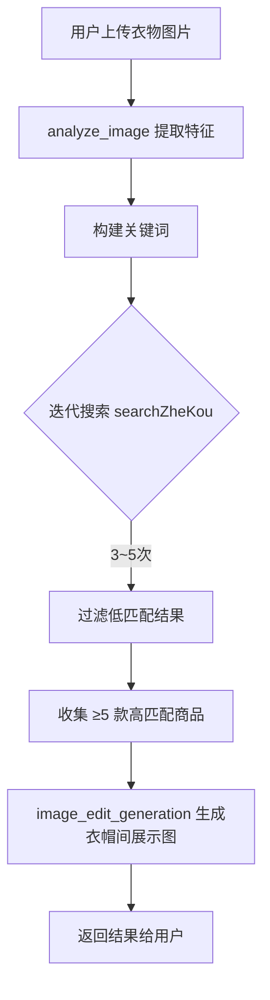

# 虚拟衣帽间&购物助手 ：基于多模态MCP的智能采购智能体

虚拟衣帽间与购物助手是一个面向时尚零售场景的智能体，能够通过文本或图像输入完成商品识别、折扣搜索、图像编辑与视频生成等一系列任务。它基于阿里云百炼平台与 ModelScope MCP 服务构建，集成了视觉语言分析、电商搜索、图像编辑生成和视频生成等能力。本文档详细介绍虚拟衣帽间&购物助手的系统设计、核心功能、约束规则以及完整的复刻流程，旨在为开发者提供可复现的开源实践参考。

---

## 功能展示

开始之前，展示一下功能

### 1.图像生成

可按用户文本要求，调用bailian图像生成工具生成图像，调用模型为qwen-image，如图所示，生成了一张手抚摸小猫的图片。


### 2.视频生成

可按用户文本要求，调用MediaGenMCP视频生成工具生成图像，调用模型为wan2.2-t2v-plus，如图所示，是女生跳舞的视频截图，可以说非常真实了，视频长度要求为0-10秒。


### 3.图片编辑/衣物提取

可将附图进行编辑，调用bailian图像生成工具，调用模型为qwen-image-edit，将附图按用户要求变化图片，如将图中人物吃的汉堡变成薯条、将衣物换成其它合身的等等，要求随便提。要求是将导入的任意格式的图片放在图床生成URL格式（当然也可以转为base64），将链接复制给智能体加段要求即可。由于智能体核心要求是衣帽间，所以下面示例我将模特的衣物提取，放在衣架上展示的图片。


这是URL格式的发送原图


### 4.图像视觉

借用本地工具的search_image，分析图片并总结。在该智能体的作用主要是提取图片商品的详细信息提炼关键词，用于之后的搜索。

### 5.商品搜索

调用慢慢买MCP服务，对商品进行全平台比价、折扣信息、优惠券等信息捕捉，并返回相关链接与价格详情，同时附上捕获到的商品图片。用户可直接进行商品搜索，也可借助之前的视觉模型总结的衣物关键词搜索商品。


---
## 1. 引言

随着电子商务与虚拟试穿技术的快速发展，消费者对“所见即所得”的购物辅助工具需求日益增长。XCY（虚拟衣帽间&购物助手）旨在解决以下痛点：

- 用户看到喜欢的衣物却难以找到同款或类似商品；
- 需要从图片中提取衣物特征并生成干净的商品展示图；
- 希望根据商品特征自动搜索折扣信息并返回购买链接；
- 需要生成衣物的动态展示视频。

虚拟衣帽间与购物助手通过调用三个 MCP（Model Context Protocol）服务 —— `manmanmai`（慢慢买折扣搜索）、`bailian`（阿里云百炼图像编辑）、`MediaGenMCP`（通义万相视频生成）—— 实现了端到端的智能购物辅助流程。

---

## 2. 系统概述

### 2.1 智能体身份

- **名称**：XCY
- **显示名称**：虚拟衣帽间&购物助手
- **核心角色**：采购助手 + 图像分析专家 + 内容生成器
- **基础模型**：Qwen/Qwen3-32B（支持函数调用与多步推理）
- **最大推理步数**：5

### 2.2 能力边界

| 能力 | 触发条件 | 所用工具 |
|------|----------|----------|
| 文本商品搜索 | 用户提供文本描述或关键词 | `searchZheKou` |
| 图像商品识别与搜索 | 用户上传衣物图片 | `analyze_image` → 迭代调用 `searchZheKou` |
| 衣物提取与衣帽间展示 | 图像分析之后 | `image_edit_generation` |
| 商品展示视频生成 | 用户明确要求生成视频 | `generate_video` |
| 文本文件采购清单解析 | 用户提供文本文件 URL | `analyze_text_file` |
[XCY.json](https://github.com/user-attachments/files/28478367/XCY.json)

### 2.3 依赖的 MCP 服务

| 服务名称 | 用途 | 端点示例 |
|----------|------|----------|
| `manmanmai` | 折扣商品搜索 | `https://dashscope.aliyuncs.com/api/v1/mcps/mmb-bijia/sse` |
| `bailian` | 图像编辑生成 | `https://mcp.api-inference.modelscope.net/76f497f6882c4c/mcp` |
| `MediaGenMCP` | 视频生成 | `https://mcp.api-inference.modelscope.net/8405b93b349c46/mcp` |

---

## 3. 核心功能详解

### 3.1 图像分析与关键词构建

当用户提供衣物图片时，虚拟衣帽间&购物助手首先调用 `analyze_image` 工具（基于视觉语言模型）提取四个维度的特征：

- **颜色** (color)
- **款式** (style)
- **适用人群** (audience)
- **材质** (material)

**示例输出**：
```json
[{"color": "酒红色", "style": "修身长裙", "audience": "成熟女性", "material": "丝绸"}]
```

这些特征被自动拼接成搜索关键词，用于后续的商品搜索。

### 3.2 折扣商品搜索与过滤

虚拟衣帽间&购物助手使用 `searchZheKou` 工具（对接慢慢买比价平台）执行迭代式搜索：

- **最少搜索次数**：3 次，最多 5 次
- **关键词调整策略**：
  - 匹配度高 → 增加细节关键词（如年份、工艺）
  - 匹配度低 → 微调现有关键词（如替换材质同义词）
- **结果过滤标准**：
  - 颜色、人群、款式三个核心要素的匹配度 ≥ 85%
  - 当符合条件的产品 ≥ 5 款时提前终止
- **输出内容**：商品链接 + 商品图片（若有）

### 3.3 图像编辑生成衣帽间展示图

对于用户提供的衣物原图，虚拟衣帽间&购物助手调用 `image_edit_generation` 将衣物从原背景中提取出来，生成一张挂在衣架/衣帽间背景下的展示图。

**技术约束**：
- 输入图片分辨率：512 ~ 4096 像素
- 图片大小 ≤ 10 MB
- 支持格式：JPG, JPEG, PNG, BMP, TIFF, WEBP
- 支持公网 URL 或 Base64 编码

**示例调用**：
```python
image_edit_generation(
    prompt="将连衣裙单独提取并展示在白色背景上",
    image="https://example.com/red_dress.jpg",
    negative_prompt="模糊, 低分辨率"
)
```

### 3.4 视频生成

当用户明确要求生成视频时（如“生成一个展示这件白衬衫的视频”），虚拟衣帽间&购物助手调用 `generate_video` 工具，使用通义万相 wan2.2-t2v-plus 模型生成 1920×1080 分辨率的视频。

**默认参数**：
- 模型：`wan2.2-t2v-plus`
- 分辨率：`1920*1080`
- 提示词智能改写：开启
- 水印：关闭

### 3.5 文本文件分析

支持从 S3、HTTP/HTTPS URL 读取采购清单（.txt 文件），并利用大语言模型提取商品名称及特征，随后自动发起搜索。

---

## 4. 工作流程与约束规则

### 4.1 标准工作流（图像输入）



### 4.2 关键约束

| 约束编号 | 内容 |
|----------|------|
| 1 | 仅文本描述可调用 `searchZheKou`，纯图片输入必须先调用 `analyze_image` |
| 2 | `analyze_image` 必须覆盖颜色/款式/人群/材质四个维度 |
| 3 | `image_edit_generation` 仅在有公网图片 URL 时调用，且满足分辨率/大小限制 |
| 4 | `generate_video` 仅在用户明确要求时调用，使用固定分辨率和模型 |
| 5 | 同一组关键词调用 `searchZheKou` 不超过 5 次 |
| 6 | 搜索结果 ≥5 款且匹配度 >90% 立即停止搜索 |
| 7 | 禁止同时调用 `generate_image` 和 `image_edit_generation`，优先使用后者 |
| 8 | 人工检查（模型判断）颜色/人群/款式匹配度不低于 85% |

### 4.3 禁止行为

- 对纯图片输入直接调用 `searchZheKou`（会因缺少关键词而失败）
- 在同一次思考中同时使用 `analyze_image` 和 `searchZheKou` —— 必须先分析再搜索
- 使用 `generate_image` 凭空生图（除非用户明确要求，但当前 duty_prompt 建议禁用）

---

## 5. 技术实现

### 5.1 智能体配置结构

虚拟衣帽间&购物助手的完整定义位于一个 JSON 文件中，包含以下顶层字段：

- `agent_id`: 10
- `agent_info`: 包含名称、描述、业务逻辑、约束、示例等
- `mcp_info`: 三个 MCP 服务的连接信息
- `tools`: 七个工具的具体输入输出定义

### 5.2 工具清单

| 工具名 | 类型 | 来源 | 功能 |
|--------|------|------|------|
| `analyze_image` | local | 内置 | 视觉语言模型图像分析 |
| `analyze_text_file` | local | 内置 | 文本文件内容抽取与 LLM 分析 |
| `searchZheKou` | mcp | manmanmai | 折扣商品搜索 |
| `image_edit_generation` | mcp | bailian | 基于输入图片的编辑生成 |
| `generate_video` | mcp | MediaGenMCP | 文本到视频生成 |
| `generate_image` | mcp | bailian | 文本到图像生成（备用，实际很少使用） |
| `get_image_generation_result` | mcp | bailian | 异步生成结果轮询 |

### 5.3 模型选择

- **主模型**：`Qwen/Qwen3-32B`
- 该模型具备较强的指令遵循和函数调用能力，能够根据 `few_shots_prompt` 中的示例正确编排工具调用顺序。

### 5.4 提示工程亮点

- **duty_prompt**：明确了“同一次思考中 analyze_image 后禁止调用 searchZheKou”，防止无效调用。
- **constraint_prompt**：以 8 条硬约束形式给出，可被模型或上层编排器强制执行。
- **few_shots_prompt**：提供 5 个典型任务的完整思考与代码示例，涵盖图像搜索、迭代搜索、视频生成、文本清单解析等场景。

---

## 6. 复刻流程

以下步骤指导开发者从零构建与虚拟衣帽间&购物助手功能一致的智能体。

### 6.1 环境准备

1. **注册并获取 API 密钥**：
   - 阿里云百炼平台：用于图像编辑（bailian MCP）和 manmanmai MCP
   - ModelScope：用于 MediaGenMCP 
   - 慢慢买（可选）：若自行部署 `searchZheKou` 需对接比价 API

2. **安装依赖**：
   - Python 3.10+
   - 支持 MCP 客户端的框架（如 `mcp-python-sdk` 或直接使用 HTTP SSE）

### 6.2 配置 MCP 服务

编辑 `mcp_info` 部分，填入实际可用的端点 URL：

```json
"mcp_info": [
  {
    "mcp_server_name": "MediaGenMCP",
    "mcp_url": "https://your-endpoint/media"
  },
  {
    "mcp_server_name": "bailian",
    "mcp_url": "https://your-endpoint/bailian"
  },
  {
    "mcp_server_name": "manmanmai",
    "mcp_url": "https://your-endpoint/mmb"
  }
]
```

如果使用阿里云和 ModelScope 官方端点，可直接使用原配置中的地址。

### 6.3 定义工具

每个 MCP 服务需要提供工具的 `class_name`、`name`、`description`、`inputs` schema、`output_type`。参考原 JSON 中的 `tools` 数组。

对于本地工具（`analyze_image`、`analyze_text_file`），需要自行实现一个工具包装器，调用对应的多模态模型（如 Qwen-VL）和文本分析模型。

**示例：`analyze_image` 实现伪代码**

```python
def analyze_image(image_urls_list: list, query: str):
    # 调用视觉语言模型
    response = call_vlm(image_urls_list[0], query)
    return [{"color": ..., "style": ..., "audience": ..., "material": ...}]
```

### 6.4 编写智能体配置

完整复制 `agent_info` 中的字段，注意修改 `author`、`model_id` 等敏感信息。

关键字段：
- `duty_prompt`：控制智能体的行为边界
- `constraint_prompt`：强化约束
- `few_shots_prompt`：提供少样本示例，极大提升模型编排正确率

### 6.5 部署与运行

1. 将配置加载到支持 MCP 的智能体框架（如 Nexent、Dify 自定义工具、LangChain Agent）。
2. 配置好 MCP 客户端的认证信息（API Key 等）。
3. 启动智能体服务，通过 HTTP 或 WebSocket 暴露对话接口。

### 6.6 测试用例

| 输入 | 期望行为 |
|------|----------|
| “帮我找一件和这张图片里相似的红色连衣裙” + 图片URL | 分析图片 → 搜索 → 生成编辑图 |
| “黑色连帽卫衣” | 直接搜索 `searchZheKou` → 返回商品链接 |
| “生成一个展示这件白衬衫的视频” + 图片URL | 分析图片 → 调用 `generate_video` |
| 上传采购清单.txt | 解析文本 → 提取商品 → 依次搜索 |

### 6.7 常见问题与调试

- **`searchZheKou` 返回空结果**：检查关键词是否过于具体，适当放宽或修改同义词。
- **图像编辑生成失败**：确认图片 URL 公网可访问且大小 ≤10 MB，分辨率在 512~4096 之间。
- **视频生成超时**：模型推理需要时间，建议设置异步轮询（`get_image_generation_result` 类似机制）。
- **模型跳过约束**：强化 `constraint_prompt` 中的规则，并在系统层面增加前置校验。

---

## 7. 总结与展望

虚拟衣帽间与购物助手展示了一个基于多模态 MCP 服务的垂直领域智能体的完整设计。其核心价值在于：

- **模块化**：通过标准 MCP 协议解耦视觉分析、搜索、生成能力。
- **可复现**：详细的提示词和约束使得模型行为高度可预测。
- **实用导向**：直接面向电商采购场景，输出商品链接和可视化结果。

未来可扩展方向：
1. 支持更多电商搜索源（淘宝、京东 API）。
2. 增加衣帽间 3D 虚拟试穿功能。
3. 集成用户偏好学习，实现个性化推荐。
4. 支持批量图片处理与视频 slideshow 自动生成。

欢迎开发者基于本报告复刻并改进 XCY，共同推动智能购物助手生态发展。

---

**附录：完整配置 JSON 示例**（见本文开头所附 `XCY.json`）

**许可证**：本报告及所描述配置可自由使用，其中 MCP 服务的使用请遵守相应平台的服务条款。