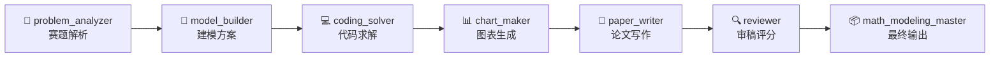

# MathModelMaster 数学建模大师

> 🧠 AI 驱动的数学建模全流程智能体系统，一站式完成赛题解析、模型构建、代码求解、图表生成、论文写作与审稿评分。

## 📖 项目简介

MathModelMaster（数学建模大师）是一个面向数学建模竞赛（CUMCM 国赛、MCM/ICM 美赛等）的 AI 智能体系统。它将数学建模全流程拆分为多个专业化智能体，配合六大知识库，能够端到端地完成从赛题分析到最终论文输出的完整建模工作。

核心能力：

- 读懂赛题并给出结构化建模方案
- 调用 23 种经典建模方法的知识库，自动匹配适用场景
- 基于代码模板快速生成 Python 求解代码并运行
- 生成符合论文发表标准的中文图表
- 根据求解结果撰写结构化论文
- 多维度审稿评分，发现论文问题并给出修改建议
- 最终输出 DOCX、PDF、PNG、ZIP 等交付物

## 🏗️ 系统架构

系统采用多智能体协作架构，每个智能体负责建模流程中的一个专业阶段：



每个智能体在各自阶段只做最专业的一件事，保证输出质量可控。

## 📚 六大知识库

| 知识库 | 内容 | 文件数 | 用途 |
|---|---|---|---|
| **优秀论文库** | 论文结构、摘要写法、模型组合、图表表达 | 7 | 训练智能体学习优秀写作 |
| **建模方法库** | AHP、TOPSIS、回归、ARIMA、LSTM、遗传算法等 23 种方法 | 24 | 提供方法选型与公式参考 |
| **代码模板库** | 数据读取、清洗、建模、预测、优化、灵敏度分析等 18 个模板 | 19 | 快速生成求解代码 |
| **图表模板库** | 流程图、指标体系图、预测拟合图、热力图、雷达图等 12 个模板 | 12 | 统一论文图表风格 |
| **论文评分库** | 竞赛评分标准、格式规范、扣分点、图表公式规范等 | 10 | 结构化审稿与自检 |
| **上传版** | 仅包含 Nexent 支持的 Markdown/CSV 格式文件 | - | 直接导入 Nexent 知识库 |

## 📂 项目结构

```text
MathMoudelMaster/
├── 数学建模大师源文件/     # 智能体配置文件（JSON）
│   ├── math_modeling_master.json
│   ├── problem_analyzer.json
│   ├── model_builder.json
│   ├── coding_solver.json
│   ├── chart_maker.json
│   ├── paper_writer.json
│   └── reviewer.json
├── KB_优秀论文库/          # 论文学习知识库（含生成脚本）
├── KB_建模方法库/          # 建模方法知识库
├── KB_代码模板库/          # 代码模板知识库
├── KB_图表模板库/          # 图表模板知识库
├── KB_论文评分库/          # 评分标准知识库
├── tools/                 # 工具脚本
│   ├── generate_math_model_kb.py
│   ├── import_kb_to_nexent_es.py
│   ├── repair_nexent_math_agent.ps1
│   └── test_*.ps1          # 测试脚本
└── docs/                  # 文档
    └── math_agent_release_check.md
```

## 🚀 快速开始

### 环境要求

- Python 3.9+
- PowerShell 7+（Windows）
- Nexent 平台
- 中文字体支持（WenQuanYi Zen Hei 等）

### 安装

```bash
git clone https://github.com/your-username/MathModelMaster.git
cd MathModelMaster
```

### 导入知识库到 Nexent

```powershell
python .\tools\import_kb_to_nexent_es.py
```

或通过 Nexent 界面上传 `KB_上传版` 目录中的文件。

### 导入智能体

将 `数学建模大师源文件` 目录中的 JSON 文件导入 Nexent 智能体配置。建议按以下名称创建：

- `math_modeling_master`（主智能体）
- `problem_analyzer`（赛题解析）
- `model_builder`（建模方案）
- `coding_solver`（代码求解）
- `chart_maker`（图表生成）
- `paper_writer`（论文写作）
- `reviewer`（审稿评分）

### 运行测试

```powershell
powershell -ExecutionPolicy Bypass -File .\tools\test_nexent_artifact_capability.ps1
powershell -ExecutionPolicy Bypass -File .\tools\test_math_modeling_delivery_smoke.ps1
powershell -ExecutionPolicy Bypass -File .\tools\test_nexent_northbound_agent_smoke.ps1
powershell -ExecutionPolicy Bypass -File .\tools\test_nexent_agent_e2e_modeling_smoke.ps1
```

## 🔄 工作流程

系统按照以下阶段逐步推进：

1. **赛题解析** — problem_analyzer 读取赛题，输出结构化问题分析
2. **建模方案** — model_builder 结合知识库，给出模型选型与组合方案
3. **代码求解** — coding_solver 运行模型代码，保存 `core_results.json` 和 `core_results.csv`
4. **图表生成** — chart_maker 绘制中文可读的论文图表（PNG）
5. **论文写作** — paper_writer 根据已有结果和图表撰写结构化论文
6. **审稿评分** — reviewer 多维度审稿，给出修改建议
7. **最终输出** — math_modeling_master 导出 DOCX、PDF、ZIP 等完整交付物

## 🛠️ 工具说明

| 工具 | 说明 |
|---|---|
| `generate_math_model_kb.py` | 生成全部知识库文件 |
| `import_kb_to_nexent_es.py` | 将知识库批量导入 Nexent Elasticsearch |
| `repair_nexent_math_agent.ps1` | 修复智能体配置 |
| `test_nexent_artifact_capability.ps1` | 验证运行时产物生成能力 |
| `test_math_modeling_delivery_smoke.ps1` | 冒烟测试：验证交付物质量 |
| `test_nexent_northbound_agent_smoke.ps1` | 验证北向 API 连通性 |
| `test_nexent_agent_e2e_modeling_smoke.ps1` | 端到端建模冒烟测试 |

## 📝 推荐使用方式

在 Nexent 中使用以下提示词开始一次完整的建模工作：

```text
从头开始做数学建模项目，建立新的 clean_rebuild 项目目录。
按阶段执行：赛题解析、建模方案、代码求解、图表生成、论文写作、审稿、最终输出。
每次只做当前阶段最有用的一步，并验证产物真实存在。
代码求解保存 core_results.json/csv；图表生成中文可读 PNG；
论文只根据已有结果和图表写；最终成果放入 99_final_outputs。
```

## ⚠️ 注意事项

- 本项目依赖 Nexent 平台运行，无法独立使用
- 建模方法库提供理论参考，实际使用时需根据赛题灵活组合
- 论文评分标准以 CUMCM 组委会最新规范为准，建议每年更新
- 优秀论文库仅收录官方公开入口，避免版权不清的二次转载

## 📄 License

MIT License. 详见 [LICENSE](LICENSE) 文件。

## 🤝 贡献

欢迎提交 Issue 和 Pull Request！

贡献方向包括：

- 补充新的建模方法文档
- 优化代码模板的通用性和可读性
- 更新竞赛评分标准
- 改进图表模板的样式和中文支持
- 完善测试覆盖

---

⭐ 如果这个项目对你有帮助，请给一个 Star！