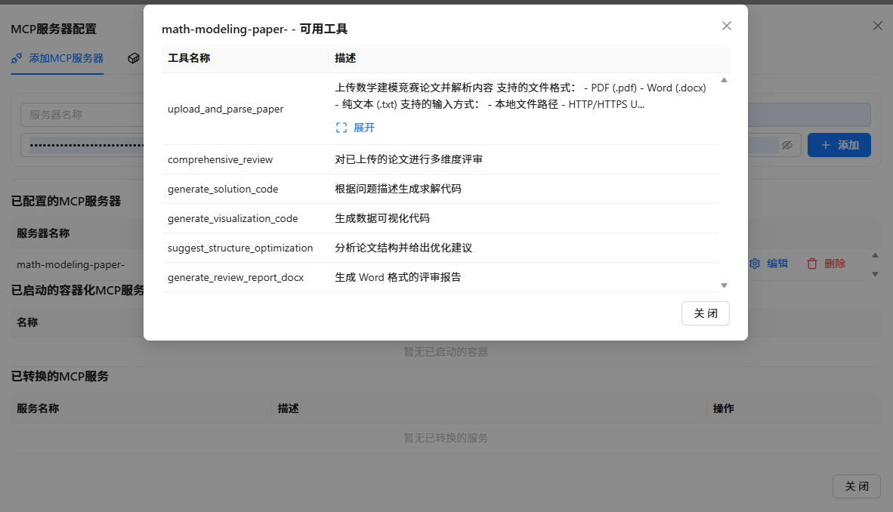
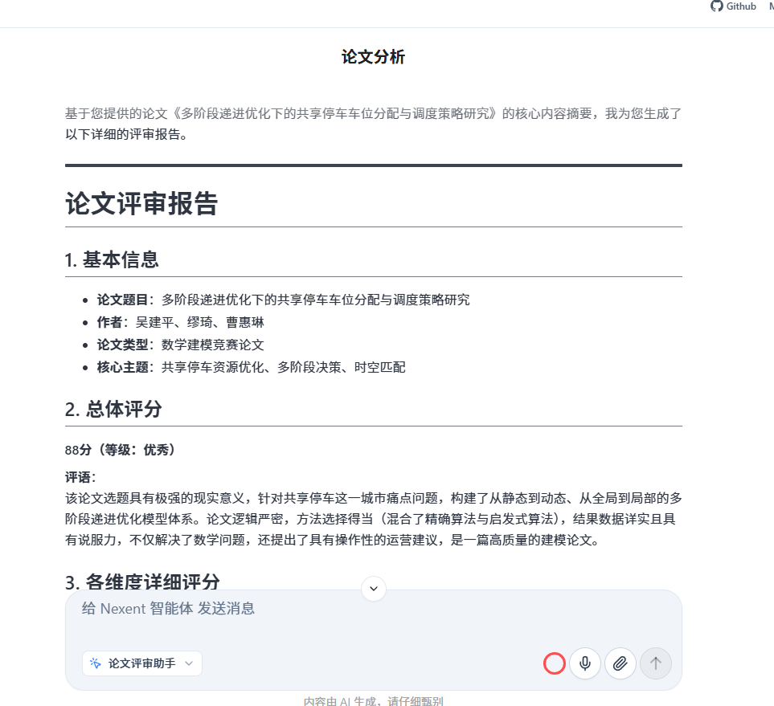

# 论文评审助手 (Paper Review Assistant)

> 基于 Nexent 平台的智能论文评审 Agent，支持多类型论文自动评审、打分、生成改进建议和 Word 报告

## 功能特性

### 支持的论文类型
| 类型 | 评审维度 | 满分 |
|------|----------|------|
| 数学建模论文 | 问题分析、模型建立、求解方法、结果分析、论文写作 | 100分 |
| 学术论文 | 创新性、方法论、实验与结果、文献综述、写作质量 | 100分 |
| 学位论文 | 研究意义、文献综述、研究方法、研究结果、论文规范 | 100分 |
| 课程论文 | 问题理解、内容质量、分析能力、结构组织、格式规范 | 100分 |

### 核心能力
1. **智能识别**：自动识别论文类型，选择对应评审标准
2. **多维度评审**：每个维度包含优点、不足、评语、得分
3. **等级评定**：优秀(90-100)、良好(80-89)、中等(70-79)、及格(60-69)、不及格(<60)
4. **改进建议**：按优先级分类（🔴高/🟡中/🟢低），提供具体可操作的建议
5. **离线引擎**：无API Key也能使用基础评审功能
6. **LLM增强**：配置SiliconFlow API Key后获得AI深度评审

## 项目结构

```
论文评审助手/
├── README.md                          # 本文档
├── paper_review_assistant.json        # Nexent 平台智能体配置
├── code/                              # 后端评审引擎代码
│   ├── router.py                      # FastAPI 路由（LLM调用 + 评审逻辑）
│   ├── offline_engine.py              # 离线评审引擎（无需API）
│   └── schemas.py                     # Pydantic 数据模型
├── skills/                            # 评审技能定义
│   └── llm-paper-review-prompts.md    # LLM评审提示词模板
└── images/                            # 配置截图和示例
    ├── MCP配置.png
    ├── 核心配置.png
    └── 报告生成示例*.png
```

## 快速开始

### 方式一：在 Nexent 平台使用（推荐）
1. Fork 本仓库
2. 在 Nexent 平台导入 `paper_review_assistant.json`
3. 配置 MCP 工具服务器地址
4. 上传论文文件（支持 PDF/DOCX/TXT）
5. 获取评审报告

### 方式二：独立部署后端服务
```bash
cd code
pip install fastapi uvicorn python-docx httpx
uvicorn router:app --host 0.0.0.0 --port 8004
```

### MCP 工具配置
```json
{
  "mcp_server_name": "math-modeling-paper-",
  "mcp_url": "http://your-server:8004/sse"
}
```

## 评审流程

```
用户上传论文 → 解析文本内容 → 识别论文类型 → 选择评审标准 → 逐维度评审 → 计算总分 → 生成改进建议 → 输出评审报告
```

## 国赛评分标准

### 总分：100分

| 维度 | 分值 | 关键检查项 |
|------|------|-----------|
| 摘要 | 10 | 五要素：问题、模型、算法、结果、结论 |
| 模型建立 | 30 | 假设(5)、符号(5)、推导(10)、创新(10) |
| 求解方法 | 25 | 算法选择(10)、描述(10)、复杂度(5) |
| 结果分析 | 20 | 正确性(10)、灵敏度(5)、对比(5) |
| 论文写作 | 15 | 逻辑(5)、图表(5)、参考文献(5) |

### 等级评定
- ≥90分：国家一等奖
- ≥80分：国家二等奖
- ≥70分：省级一等奖
- ≥60分：省级二等奖
- <60分：需大幅改进

## 输出示例

```markdown
# 论文评审报告

## 基本信息
- 论文类型：数学建模论文
- 题目：基于灰色预测模型的碳排放量预测研究

## 总体评分
85分（等级：良好）

## 各维度详细评分

### 1. 问题分析（18/20分）
**优点**：
- 问题背景阐述清晰，碳排放预测具有现实意义
- 明确提出了预测目标和约束条件

**不足**：
- 对现有预测方法的局限性分析不够深入

**评语**：问题分析部分较好地界定了研究范围，但缺少对同类方法的对比分析。

### 2. 模型建立（26/30分）
...

## 改进建议

### 🔴 高优先级（必须修改）
1. 缺少模型假设的合理性验证
   - 位置：模型建立部分
   - 建议：增加对灰色模型适用条件的论证

### 🟡 中优先级（建议优化）
2. 未与其他模型进行对比
   - 建议：增加与ARIMA、神经网络等模型的对比分析

### 🟢 低优先级（锦上添花）
3. 参考文献数量偏少
   - 建议：补充近3年相关文献5-8篇
```

## 技术栈

- **后端**：FastAPI + Python 3.10+
- **LLM**：SiliconFlow API（Qwen系列）
- **文档处理**：python-docx（Word生成）
- **平台**：华为 Nexent Agent Platform

## 截图预览

| MCP配置 | 核心配置 |
|---------|----------|
|  |  |

| 报告示例1 | 报告示例2 |
|-----------|-----------|
|  |  |

## 作者

- **吴建平** (Tomlegend2026)
- 重庆大学计算机科学与技术学院
- 邮箱：wjpyszd703@qq.com

## License

Apache License 2.0
